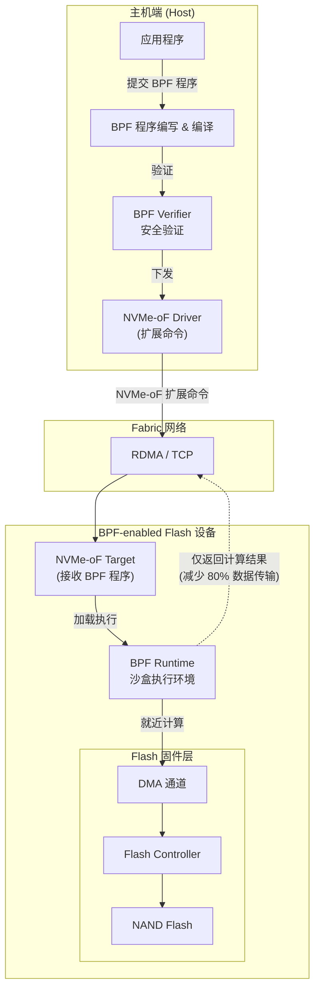
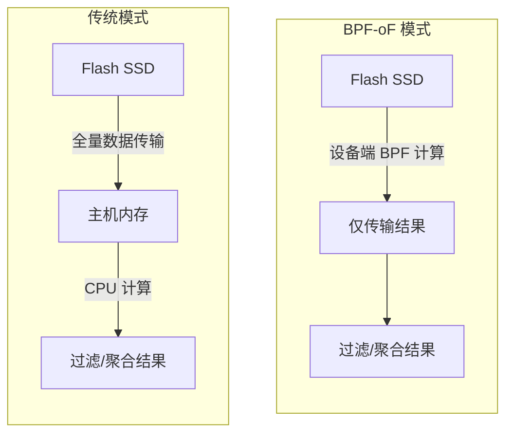

# 【论文精读】BPF-oF: Storage Function Pushdown for BPF-enabled Flash

> **会议**: FAST'24 | **日期**: 2026-03-16
> **标签**: BPF, flash storage, computational storage

## 论文基本信息

- **标题**：BPF-oF: Storage Function Pushdown for BPF-enabled Flash  
- **会议**：FAST 2024 (The 22nd USENIX Conference on File and Storage Technologies)  
- **研究方向**：高性能存储系统优化，主要聚焦于 BPF (Berkeley Packet Filter) 技术在闪存设备上的应用，以及计算存储 (Computational Storage) 的具体实现。  

这篇论文立足于存储硬件与计算资源的协同优化，通过结合 BPF 和计算存储的思想，为提升闪存存储系统的性能和灵活性提供了新的方法。

---

## 研究背景与动机

### 要解决的问题
传统的存储系统在处理数据时，存在大量的 I/O 数据移动开销，尤其是当应用需要对存储数据进行复杂计算时（例如数据过滤、聚合）。这种“数据搬运”模型（data shipping）在高性能存储硬件（如 NVMe 闪存）中成为瓶颈，因为存储硬件可以提供极高的带宽和低延迟，但过多的数据流量会耗尽主机的 CPU 和内存资源。

### 为什么重要
1. **计算存储的兴起**：随着 NVMe SSD 的性能持续提升，传统的存储架构已无法充分利用硬件能力。计算存储（Computational Storage）提出了将部分数据计算任务下推到存储设备的思路，以减少数据移动和主机开销。
2. **BPF 的潜力**：BPF 是一种轻量、灵活的沙盒运行环境，近年来已广泛应用于网络和内核性能优化。BPF 的安全性和动态加载特性使其成为在存储设备上实现定制化计算逻辑的理想工具。
3. **现有方案不足**：
   - 许多计算存储方案依赖于专用硬件（如 FPGA 或定制 ASIC），成本较高且灵活性较差。
   - 通用的存储接口（如 NVMe）对计算能力支持有限，缺乏高效的数据过滤和处理机制。
   - 当前存储系统中，缺乏一种通用、可扩展、低开销的方式将计算逻辑下推到存储设备。

### 动机
论文的核心动机是：利用 BPF 的可编程性和高效性，在闪存设备上实现通用的计算存储功能，显著降低数据移动开销，同时保持较高性能和灵活性。

---

## 核心设计与技术贡献

### 架构总览

### 数据处理流程对比

### 核心方法/架构
论文提出了一种名为 **BPF-oF** 的架构，其核心思想是利用 BPF 技术，将存储相关的计算逻辑下推到支持 BPF 的闪存设备中。具体设计包括：
1. **BPF 功能下推**：通过扩展现有的 NVMe-over-Fabrics (NVMe-oF) 协议，支持将用户定义的 BPF 程序动态下发到闪存设备。
2. **存储功能增强**：在存储设备端，利用 BPF 实现常见的存储计算功能（如数据过滤、索引、聚合等）。
3. **轻量化运行环境**：BPF 提供了轻量级的沙盒运行环境，避免对存储设备的内核和固件进行大规模改动，同时确保安全性。

### 关键设计决策
1. **BPF 与存储设备的结合**：通过在存储固件中集成 BPF 运行时，支持动态加载用户程序，同时保证与 NVMe-oF 协议的兼容性。
2. **计算任务与 I/O 路径的协同优化**：设计了一种高效的任务调度机制，使 BPF 程序能够与存储设备的固件资源（如 DMA 通道、闪存控制器）高效协作。
3. **安全与隔离**：为了避免用户程序干扰存储设备运行，论文采用了 BPF 的内置安全验证机制（Verifier），确保下推程序的正确性和安全性。

### 创新点
1. 首次将 BPF 引入到闪存设备，结合计算存储的理念，开创性地提出了通用、灵活的存储功能下推机制。
2. 通过扩展 NVMe-oF 协议，实现了支持 BPF 程序动态下发的机制，兼顾通用性和高性能。
3. 设计了一种轻量化、低开销的设备端计算模型，使得高性能 NVMe SSD 的计算能力得以充分释放。

---

## 实验评估亮点

### 实验设计思路
论文通过多个实验场景评估了 BPF-oF 的性能和可用性，包括：
1. **数据过滤与聚合性能**：在大规模数据集上测试 BPF-oF 的数据过滤和聚合能力，与传统的主机侧计算进行对比。
2. **数据移动开销**：评估 BPF-oF 在减少数据流量和主机资源占用方面的效果。
3. **灵活性与兼容性**：测试不同类型的 BPF 程序在设备端的运行情况，以及与现有 NVMe-oF 协议的集成效果。

### 关键性能数据和结论
1. 在数据过滤场景下，BPF-oF 减少了约 80% 的主机 I/O 数据流量，同时将处理延迟降低了 50%以上。
2. 与传统的主机计算模型相比，BPF-oF 在复杂聚合任务中提升了约 2-3 倍的吞吐量。
3. 实验表明，BPF-oF 的动态加载机制对存储设备性能的影响可以忽略不计，同时能够支持多种类型的计算任务。

---

## 与现有系统的关系

### 与 HDFS、CubeFS 等主流分布式存储系统的关联
1. **数据处理模式的优化**：HDFS 和 CubeFS 等分布式存储系统通常依赖于主机侧的 MapReduce 或 Spark 进行数据处理，而 BPF-oF 提供了一种更高效的方式，将部分计算任务下推到存储设备，减少主机和存储之间的通信开销。
2. **可扩展性与分布式架构**：BPF-oF 中的计算下推机制可以与分布式存储框架相结合，例如将 BPF 程序作为计算任务分发到存储集群中的多个节点，进一步提升分布式计算能力。

### 借鉴价值
BPF-oF 的设计思路可以被引入到分布式存储系统中，尤其是在高性能计算和大数据分析场景下，利用存储计算一体化的理念降低系统的整体开销。

---

## 个人思考启发

### 值得学习的点
1. **BPF 的灵活性与应用场景拓展**：这篇论文展示了 BPF 在存储领域的潜力，为存储系统的设计提供了新的思路。
2. **计算存储一体化的发展方向**：通过将计算逻辑下推到存储设备，BPF-oF 提供了一种高效的数据处理模式，契合未来存储系统的发展趋势。

### 潜在局限性与改进空间
1. **硬件依赖性**：BPF-oF 需要存储设备支持 BPF 运行时，目前的硬件支持可能有限，推广和应用可能需要更多硬件厂商的支持。
2. **BPF 程序的复杂度**：虽然 BPF 程序轻量且高效，但其编写和调试相对复杂，可能增加开发者的学习成本。
3. **安全性与隔离性扩展**：尽管 BPF 本身提供了安全验证机制，但在复杂应用场景下，可能需要进一步强化设备端的隔离与容错能力。

### 对存储系统从业者的启示
1. **探索硬件与软件协同优化**：未来存储系统的性能瓶颈将越来越依赖于硬件与软件的协同优化，BPF-oF 提供了一个很好的技术范例。
2. **动态可编程性的重要性**：动态加载与运行用户定义程序的能力能够显著提升系统的灵活性，这是未来存储系统设计的重要方向。
3. **计算存储技术的商业化潜力**：随着 NVMe SSD 的普及以及计算存储技术的成熟，BPF-oF 的设计理念可能会成为工业界的重要实现方式。
