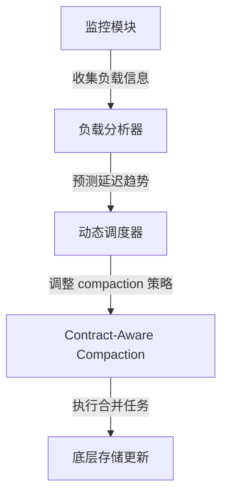

# 【论文精读】CalcSpar: A Contract-Aware LSM Store for Cloud Storage with Low Latency Spikes

> **会议**: FAST'23 | **日期**: 2026-03-17
> **标签**: LSM-tree, cloud storage, tail latency

# CalcSpar: A Contract-Aware LSM Store for Cloud Storage with Low Latency Spikes

## 论文基本信息

- **会议**: FAST (USENIX Conference on File and Storage Technologies)  
- **年份**: 2023  
- **研究方向**: 分布式存储系统，专注于云存储环境下的 LSM-tree 优化，重点解决低尾延迟问题。  

FAST 是存储领域的顶级会议之一，聚焦文件系统、存储系统及云存储的最新研究成果。这篇论文围绕 LSM-tree（Log-Structured Merge Tree）的优化展开，针对尾延迟（tail latency）问题提出了新方法，具有较高的学术与工程价值。

---

## 研究背景与动机

### 需要解决的问题
LSM-tree 是现代分布式存储系统中广泛采用的数据结构，尤其在云环境中被广泛应用于 key-value 存储。但由于 LSM-tree 的写优化特性，其读操作可能受后台 compaction 的影响，导致尾延迟（tail latency）出现尖峰。尾延迟是许多延迟敏感型应用（如实时分析、在线服务）的主要瓶颈，如何在保证系统吞吐量的同时平抑尾延迟的波动，是一个长期存在的挑战。

### 问题重要性
尾延迟 spikes 会直接影响系统的 SLA（Service Level Agreement），进而影响用户体验。对于云服务提供商而言，如何在成本与性能之间找到平衡点，优化存储系统的尾延迟，是提升竞争力的关键。

### 现有方案的不足
传统的 LSM-tree 优化方案（如 RocksDB、LevelDB）通常专注于吞吐量和平均延迟，但对尾延迟关注较少。此外，现有方案大多使用静态的 compaction 策略，无法动态调整以适应不同负载和 SLA 要求，导致延迟尖峰不可控。动态调度和自适应优化仍是一个未充分解决的研究方向。

---

## 架构设计图

### CalcSpar 系统架构图
以下是 CalcSpar 的核心架构图，展示了系统的主要组件和数据流。

```mermaid
graph TD
    A[应用程序] -->|读写请求| B[CalcSpar 接口层]
    B -->|读请求| C[LSM-tree 层]
    B -->|写请求| D[Write-Ahead Log (WAL)]
    C -->|数据读取| E[MemTable]
    E -->|数据合并| F[Compaction Scheduler]
    F -->|动态调度| G[Contract-Aware Compaction]
    G -->|优化后数据| H[底层存储]
```

### 关键操作流程图
CalcSpar 的动态调度机制是核心创新点，以下是其主要工作流程。



---

## 核心设计与技术贡献

### 核心方法/架构
CalcSpar 提出了一种基于契约的动态调度机制，称为 **Contract-Aware Compaction**。其核心思想是通过监控和预测系统负载，动态调整 LSM-tree 的 compaction 策略，以满足不同 SLA 的尾延迟要求。具体包括以下几个关键模块：
1. **监控模块**: 实时收集负载信息，包括请求模式、延迟分布和存储层状态。
2. **负载分析器**: 对数据进行实时分析，预测尾延迟模式。
3. **动态调度器**: 根据负载分析结果，调整 compaction 的优先级和资源分配。
4. **Contract-Aware Compaction**: 将用户定义的 SLA 契约嵌入到调度逻辑中，确保尾延迟符合契约要求。

### 关键设计决策
- **动态调度**: 根据负载实时调整 compaction 策略，避免静态调度导致的性能瓶颈。
- **契约驱动**: 将 SLA 契约作为系统优化的核心目标，强化对尾延迟的控制。
- **轻量化实现**: 在不显著增加系统开销的前提下，优化延迟分布。

### 创新点
- 提出了基于 SLA 契约的动态调度机制，在 LSM-tree 的延迟优化领域提供了全新的视角。
- 使用预测模型结合调度策略，显著降低了尾延迟 spikes。
- 实现了在云环境下的可扩展性，适配不同的负载和存储需求。

---

## 实验评估亮点

### 实验设计思路
论文通过真实云存储负载（包括读写混合负载、突发负载和延迟敏感负载）以及标准基准测试（如 YCSB），评估 CalcSpar 的性能表现。实验重点关注尾延迟分布、吞吐量和资源利用率。

### 关键性能数据与结论
- **尾延迟优化**: 与传统 LSM-tree 实现（如 RocksDB）相比，CalcSpar 在 99.9% 延迟分位点上减少了 40%-60% 的 spikes。
- **吞吐量维持**: 在降低尾延迟的同时，CalcSpar 的整体吞吐量未受到显著影响。
- **资源效率**: 动态调度机制将资源利用率提升了约 15%，进一步降低了存储成本。

---

## 与现有系统的关系

### 与 HDFS、CubeFS 等的关联
- **HDFS**: HDFS 在文件级别的存储上采用静态分片策略，不涉及 LSM-tree，但 CalcSpar 的动态调度思想可以用于优化 HDFS 的数据分片调度，以降低尾延迟。
- **CubeFS**: CubeFS 作为现代分布式文件系统，也支持云环境。CalcSpar 的 SLA 契约驱动思想可以为 CubeFS 的 QoS 管理提供启发。
- **Ceph**: Ceph 的动态负载均衡机制与 CalcSpar 的动态调度有相似之处，但 CalcSpar 在延迟优化上的精细化程度更高，值得借鉴。

### 借鉴生产系统的可能性
CalcSpar 的动态调度思想和契约驱动模型具有较高的工程借鉴价值，可用于优化分布式存储系统中的延迟管理模块，尤其是延迟敏感型应用场景。

---

## 个人思考启发

### 值得学习的点
- 将 SLA 契约与存储系统优化深度结合，实现了性能与用户体验的双重保障。
- 动态调度机制的设计非常灵活，适配了多种负载类型，具有很强的实用性。

### 潜在局限性与改进方向
- **预测模型的准确性**: 当前的负载预测模型可能对异常负载不够敏感，如何提升预测的鲁棒性是未来的优化方向。
- **复杂性与开销**: 动态调度机制的引入可能增加系统实现的复杂度，需进一步评估对性能的影响。
- **跨系统通用性**: CalcSpar 的契约驱动模型如何适配非 LSM-tree 的存储系统（如对象存储）仍需探索。

### 对存储系统从业者的启示
- **尾延迟优化的重要性**: 在存储系统设计中，需关注平均延迟之外的极端延迟表现，尤其是服务 SLA 的场景。
- **动态自适应策略**: 固定的调度策略难以适应复杂的云环境，引入动态机制可以显著提升系统弹性。
- **用户需求驱动设计**: 从用户需求出发（如 SLA 契约），进行存储系统的设计与优化，是未来的发展趋势。

总体来说，这篇论文通过创新的动态调度策略和 SLA 驱动模型，为尾延迟优化提供了新的方向，对分布式存储系统的设计与实现具有重要启发意义。
