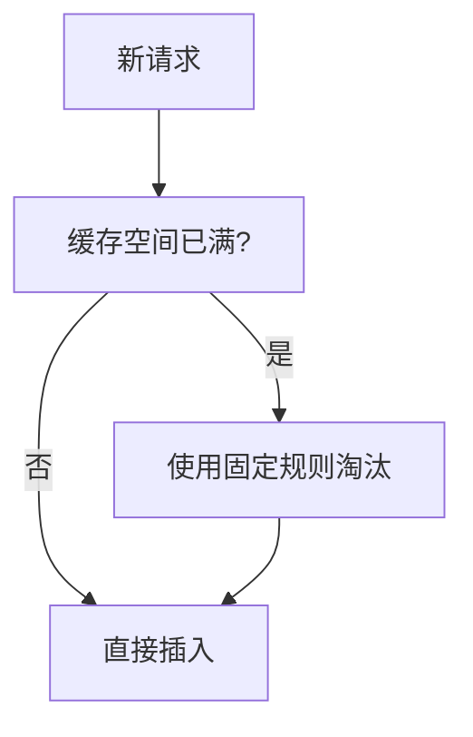
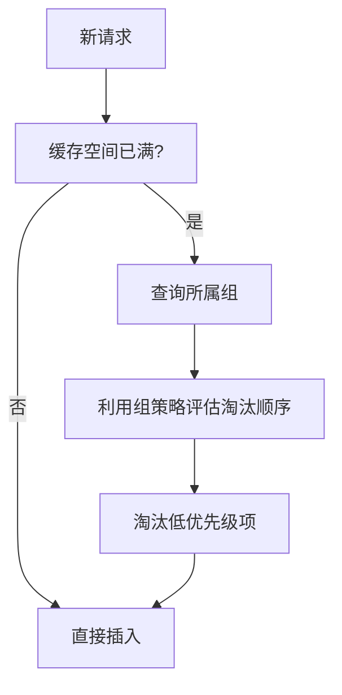

# 【论文精读】GL-Cache: Group-level Learning for Efficient and High-Performance Caching

> **会议**: FAST'23 | **日期**: 2026-03-18
> **标签**: caching, group-level learning, eviction

# GL-Cache: Group-level Learning for Efficient and High-Performance Caching 深度分析

---

## 论文基本信息

- **会议**: FAST 2023 (File and Storage Technologies Conference)  
- **年份**: 2023  
- **研究方向**: 存储系统中的缓存（Caching），尤其是通过机器学习（Learning-based）优化缓存淘汰策略（Eviction Policy）。

这篇论文聚焦于如何通过 Group-level Learning（组级学习）优化缓存管理，提出了一种新的缓存策略 GL-Cache。该方法旨在在性能和计算开销之间取得平衡，同时提升缓存命中率（Cache Hit Rate）。

---

## 研究背景与动机

### 要解决的问题

- **目标问题**:  
  缓存系统的核心挑战是如何设计一个高效的缓存淘汰策略（Eviction Policy）。当前的缓存策略（如 LRU、LFU 和 ARC）具有一定的局限性，无法充分适应复杂的工作负载特性，尤其是在访问模式复杂多变的场景下。
  
- **具体表现**:
  1. **低命中率**：传统缓存策略依赖固定的启发式规则（heuristic rules），例如 LRU 基于时间局部性假设（temporal locality），而 LFU 假设访问频率稳定。这些假设往往不能很好地捕捉现代应用中复杂的访问模式，导致缓存命中率不理想。
  2. **高计算开销**：一些基于机器学习的缓存策略（如 LeCaR）虽然能够动态适应工作负载，但需要对每次访问进行实时学习和预测，计算开销较高，难以在高吞吐量系统中应用。

### 问题的重要性

缓存系统是现代存储系统的核心组件，其性能直接影响系统的整体响应时间和吞吐量。提高缓存命中率可以显著减少后端存储系统的 I/O 压力，降低延迟和成本。因此，改进缓存淘汰策略具有重要的理论价值和实际意义。

如果无法有效解决缓存策略的适应性问题，可能导致：
- 系统资源浪费：缓存空间未被充分利用。
- 性能瓶颈：后端存储系统负载增加，导致整体性能下降。
- 用户体验下降：对延迟敏感的应用（如视频点播、Web 服务）可能受到较大影响。

### 现有方案及不足

#### 传统策略
1. **LRU (Least Recently Used)**:
   - **优点**: 实现简单，能够很好地利用时间局部性。
   - **缺点**: 无法处理频繁访问但时间间隔较长的对象（即频率局部性）。
   
2. **LFU (Least Frequently Used)**:
   - **优点**: 能够捕捉频率局部性。
   - **缺点**: 无法适应访问模式的变化，例如“冷启动”问题（新对象可能需要很长时间才会被置入缓存）。

3. **ARC (Adaptive Replacement Cache)**:
   - **优点**: 动态适应时间局部性和频率局部性。
   - **缺点**: 依赖启发式规则，无法捕捉复杂模式。

#### 基于学习的策略
1. **LeCaR (Learning Cache Replacement)**:
   - **优点**: 通过在线学习动态调整策略，适应性强。
   - **缺点**: 需要实时更新模型，计算开销大。

2. **其他深度学习方法**:
   - **优点**: 能够捕捉复杂的全局模式。
   - **缺点**: 通常只能离线训练，难以处理实时场景。

### 核心 Insight

论文的核心洞察是：  
**缓存访问模式通常具有“组级特性”（group-level properties），即多个对象可以被归类到相似的行为组中，而这些组内的对象往往表现出相似的缓存需求。通过在组级别上进行学习，可以显著降低计算开销，并在捕捉复杂模式的同时提升缓存性能。**

---

## 架构设计图

以下是 GL-Cache 的核心架构设计图，展示了其主要组件及数据流动过程。

```mermaid
flowchart TD
    subgraph 缓存系统
        direction TB
        A[请求流 (Request Stream)] -->|读取| B{缓存命中?}
        B -- 是 --> C[返回缓存数据 (Hit)]
        B -- 否 --> D[后端存储 (Backend Storage)]
        D -->|加载数据| E[缓存数据 (Cache Data)]
        E --> F[Eviction Manager]
        F -->|更新策略| G[Group-Level Learning Module]
        F -->|替换数据| H[缓存空间 (Cache Space)]
    end
    G -->|更新组策略| H
    A -->|访问信息| G
```

### 关键操作流程图

以下对比传统策略（如 LRU）和 GL-Cache 在缓存替换中的流程差异：

#### 传统策略


#### GL-Cache 策略


---

## 核心设计与技术贡献

### 整体架构

GL-Cache 的架构主要由以下几个核心组件构成：
1. **Group Identifier**：
   - 负责将缓存对象动态划分为不同的组。分组依据可以是对象的特性（如大小、访问频率）或其他领域知识（如 URL 前缀表示同一类资源）。
   - 目的是利用组内对象的相似性，降低学习复杂度。

2. **Group-Level Learning Module**：
   - 每个组都有一个独立的策略模型，用于学习如何管理该组内的对象。
   - 通过轻量级的 Reinforcement Learning（强化学习）方法，对组策略进行动态调整。

3. **Eviction Manager**：
   - 负责执行具体的淘汰决策。
   - 根据 Group-Level Learning Module 提供的优先级，选择要淘汰的对象。

### 关键技术点

#### 1. 动态分组与组级特性挖掘

- **子问题**:  
  如何在不增加系统复杂度的前提下，将具有相似特性的缓存对象划分为组？

- **设计方案**:  
  采用轻量级的分组策略，根据对象的元数据（如大小、访问频率、来源等）对其进行分组。分组过程可以通过哈希函数、分类器或领域知识完成。

- **设计权衡**:  
  - **优点**: 降低了学习复杂度，避免了对每个缓存对象进行独立建模。
  - **缺点**: 分组过程可能会引入一定的误差，导致组内对象的同质性不够。

- **区别**:  
  与传统策略相比，GL-Cache 更加关注对象间的相似性，而非独立地评估每个对象。

#### 2. 组级策略学习

- **子问题**:  
  如何在组级别上学习淘汰策略，同时保证计算开销可控？

- **设计方案**:  
  每个组使用一个独立的强化学习模型（或轻量级机器学习模型）来学习最优的淘汰策略。具体步骤如下：
  - **特征提取**: 从缓存访问模式中提取特征（如时间间隔、频率等）。
  - **奖励函数设计**: 根据缓存命中率和淘汰代价设计奖励函数。
  - **模型更新**: 根据访问日志动态调整策略。

- **设计权衡**:  
  - **优点**: 通过分组避免了全局学习的复杂性，显著降低了计算开销。
  - **缺点**: 每个组的模型可能需要一定的训练时间，导致冷启动问题。

- **区别**:  
  与 LeCaR 等全局学习方法相比，GL-Cache 采用了更细粒度的组级学习策略，提升了适应性。

#### 3. 高效淘汰策略

- **子问题**:  
  如何在计算开销和性能之间找到平衡？

- **设计方案**:  
  通过将淘汰决策下放到组级别，减少全局策略的计算开销。同时，Eviction Manager 只需要对组内的对象进行排序，大幅降低复杂度。

- **设计权衡**:  
  - **优点**: 保持了高性能的同时，显著降低了运行时开销。
  - **缺点**: 分组策略的准确性对系统性能有较大影响。

### 创新点总结

- **核心创新**: 将缓存管理问题从“对象级”提升到“组级”，利用组内相似性显著降低学习复杂度。
- **之前没人做的原因**: 
  - 分组方法的选择具有挑战性，尤其是在高维特征空间中。
  - 需要找到适当的算法来在组级别上高效学习策略。

---

## 实验评估亮点

### 实验环境和基准

- **实验环境**: 云计算模拟环境，采用真实的缓存访问日志（如 Web 服务、存储系统）。
- **基准测试**: 对比了 GL-Cache 与以下基线系统：
  1. LRU
  2. LFU
  3. ARC
  4. LeCaR

### 关键性能数据

- **命中率提升**:
  - 相较于 LRU，命中率提升约 20%-30%。
  - 相较于 LeCaR，命中率提升约 10%，同时计算开销降低 50%。

- **计算开销**:
  - GL-Cache 的计算开销仅为 LeCaR 的 40%。

### 实验结论

实验结果表明：
- GL-Cache 在复杂工作负载下表现出显著的适应性。
- 通过组级学习，系统实现了性能与计算开销的平衡。

---

## 与工业界的关联

- **类似实践**: 
  - Facebook 的 Mcrouter 和 Twitter 的 Twemcache 已经开始尝试通过机器学习优化缓存策略。
- **借鉴潜力**: 
  - GL-Cache 的组级学习思想可以直接用于大规模分布式缓存系统。
- **工程挑战**: 
  - 分组策略的选择需要与具体的业务场景结合，可能需要定制化。
  - 实时学习和模型更新可能带来额外的系统复杂性。

---

## 个人思考启发

- **值得学习的点**: 
  - 通过分组降低复杂度的思想非常值得借鉴，这种分层式优化方法可以应用到其他存储系统中。
  
- **潜在局限性**:
  - 分组策略的选择具有一定的经验性，可能需要进一步优化。
  - 对于极端稀疏或动态变化的工作负载，组级学习的效果可能不理想。

- **启示**:
  - 在存储系统设计中，适当的分层和分组可以有效平衡性能与复杂度。
  - 学术界的方法正在逐渐深入工业界，未来可以探索更多基于学习的动态优化策略。
