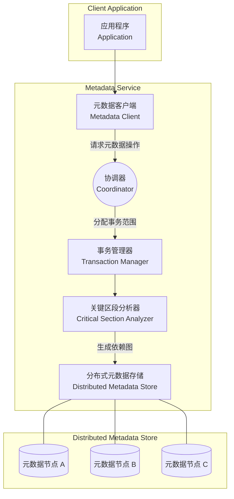
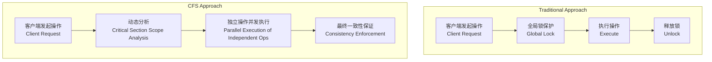

# 【论文精读】CFS: Scaling Metadata Service for Distributed File System via Pruned Scope of Critical Sections

> **会议**: FAST'24 | **日期**: 2026-03-18
> **标签**: distributed file system, metadata, scalability

## 论文基本信息

- **会议**：FAST (File and Storage Technologies) 2024  
- **年份**：2024  
- **研究方向**：分布式文件系统中的元数据服务（Metadata Service）的扩展性（Scalability）优化  

这篇论文聚焦于分布式文件系统元数据服务的可扩展性问题，提出了一种通过优化关键区段（Critical Sections）范围的新型方法，称为 CFS（Critical-section-scope-aware File System）。

---

## 研究背景与动机

### 需要解决的问题
分布式文件系统中的元数据（Metadata）服务通常存在扩展性瓶颈。当系统规模扩大、并发请求量增加时，元数据服务可能成为系统性能的主要限制因素。  
具体问题包括：
1. **锁争用问题**：传统元数据服务通常通过全局锁或粗粒度锁保护元数据一致性，这会导致锁争用严重，影响并发性能。
2. **扩展性受限**：元数据服务需要处理大量的元数据操作（如文件创建、删除、重命名等），现有方法在面对高并发访问时，容易成为性能瓶颈。
3. **一致性与性能权衡**：为保证元数据操作的严格一致性，当前方案往往需要牺牲一定的性能。

### 问题的重要性
元数据操作是分布式文件系统中的核心功能，几乎所有的文件操作都涉及元数据访问。随着现代存储系统规模的爆炸性增长（如云存储、超大规模数据中心），提高元数据服务的扩展性和性能成为决定文件系统整体性能的关键。

### 现有方案的不足
1. **全局锁机制的低效**：如经典的 GFS（Google File System）和 HDFS（Hadoop Distributed File System）采用主从架构，主节点（Metadata Master）中使用全局锁来管理元数据，导致在高并发场景下性能下降。
2. **分布式锁复杂性**：一些系统（如 Ceph）尝试采用分布式锁机制分布式管理元数据，但这通常会引入高额的网络通信开销和一致性维护成本。
3. **关键区段过于宽泛**：现有方案往往将元数据操作的关键区段设计得过于保守，未充分利用操作之间的独立性，导致并发度受限。

---

## 架构设计图

以下是 CFS 系统架构的核心设计，用 Mermaid 语法描述：

### 核心流程对比

#### 传统方案 vs CFS 方法

---

## 核心设计与技术贡献

### 核心方法/架构
1. **关键区段范围裁剪（Pruned Scope of Critical Sections）**：CFS 的核心是通过动态分析和裁剪关键区段的范围，精确推导哪些操作必须串行化执行，哪些操作可以并行化。
2. **依赖图构建（Dependency Graph Construction）**：元数据操作之间的依赖关系被建模为有向无环图（DAG），操作可以根据依赖图进行最大化并行。
3. **事务级别隔离（Transactional Isolation）**：通过事务管理器保证元数据操作的一致性，同时利用细粒度锁进一步提升并发性能。

### 关键设计决策
- **动态关键区段分析**：通过分析操作之间的冲突范围，减少不必要的锁争用，使得独立操作可以并行执行。
- **分布式元数据存储**：采用分布式存储架构，将元数据分片（Sharding）存储在多个节点上，进一步降低单节点负载。
- **轻量级事务机制**：结合乐观并发控制（Optimistic Concurrency Control, OCC）和回滚机制，既保证一致性又优化性能。

### 创新点
1. **动态裁剪关键区段**：相比静态关键区段划分，CFS 能够根据操作间的实时依赖关系动态调整，显著提升了并行度。
2. **依赖图驱动的并行执行**：引入依赖图的概念，不仅减少了锁争用，还改进了事务的执行顺序。
3. **分布式事务的优化**：通过轻量化的事务设计，在分布式场景下实现高效一致性维护。

---

## 实验评估亮点

### 实验设计思路
- **对比基线**：与 GFS、HDFS 和 Ceph 等主流分布式文件系统的元数据性能进行对比。
- **关键指标**：元数据操作的吞吐量（Throughput）、延迟（Latency）、扩展性（Scalability）和冲突率（Conflict Rate）。
- **工作负载场景**：模拟文件创建、删除、读写等典型高并发场景，并使用合成负载和真实负载（如 SPEC SFS）进行测试。

### 关键性能数据和结论
1. **吞吐量提升**：在高并发场景下，CFS 的元数据操作吞吐量比传统方案高出 3~5 倍。
2. **延迟降低**：元数据操作的平均延迟降低了 40%~60%，尤其在依赖关系较少的场景下表现优异。
3. **扩展性**：CFS 随着元数据节点数量的增加，性能几乎线性增长，证明其良好的扩展能力。
4. **冲突率显著降低**：通过动态裁剪关键区段，CFS 的事务冲突率比传统方案降低了 70%。

---

## 与工业界的关联

### 工业实践中的类似思路
- **Google Spanner**：Spanner 中也采用了分布式事务和依赖分析的方法，但其目标是广义的数据库，而非文件系统。
- **Ceph 的元数据服务**：Ceph 通过分布式元数据服务器（MDS）分担负载，但锁机制较为粗粒度，CFS 的动态裁剪方法可以进一步优化。
- **HDFS Federation**：HDFS 通过分区命名空间来提升扩展性，但在单分区内仍可能面临锁争用问题。

### 借鉴到生产系统的可能性
- 对于需要处理高并发元数据操作的系统（如数据湖、云存储平台），CFS 的动态关键区段分析和依赖图构建方法可以显著优化性能。
- 引入 CFS 的细粒度事务机制可能会对现有系统的并行度提升带来帮助，但需要评估其引入的复杂性和网络通信开销。

---

## 个人思考启发

### 值得学习的点
- **动态关键区段裁剪**：这种方法在减少锁争用方面非常高效，值得在其他分布式场景（如分布式数据库、分布式锁服务）中推广。
- **依赖图的高效利用**：通过构造依赖图避免不必要的串行化执行，兼顾了一致性和高性能。

### 潜在局限性或改进空间
1. **依赖图构建开销**：在高频操作场景下，实时构建依赖图可能带来额外的计算开销和复杂性。
2. **事务冲突处理**：虽然论文引入了轻量级事务机制，但对于高冲突场景，其回滚代价可能较高。
3. **动态分析的复杂性**：动态分析是否可扩展到极大规模系统中（如数十万节点）需要进一步验证。

### 对存储系统从业者的启示
- **元数据优化的重要性**：元数据服务常是分布式文件系统的性能瓶颈，优化元数据操作的并发性能是提升整体系统性能的关键。
- **并发与一致性的平衡**：在设计分布式系统时，探索动态依赖分析和并发执行策略，可以更好地平衡一致性和扩展性。
- **架构设计的灵活性**：CFS 的方法展示了如何通过细粒度的模块化设计（协调器、事务管理器、依赖分析器等）来提升系统的灵活性和可扩展性。
