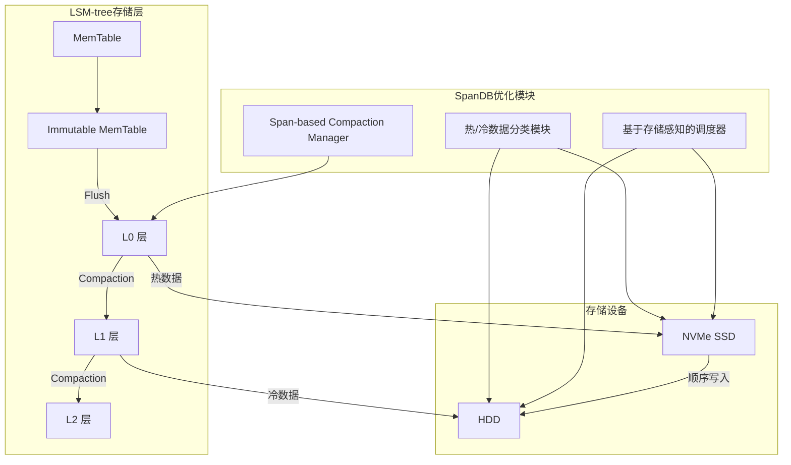
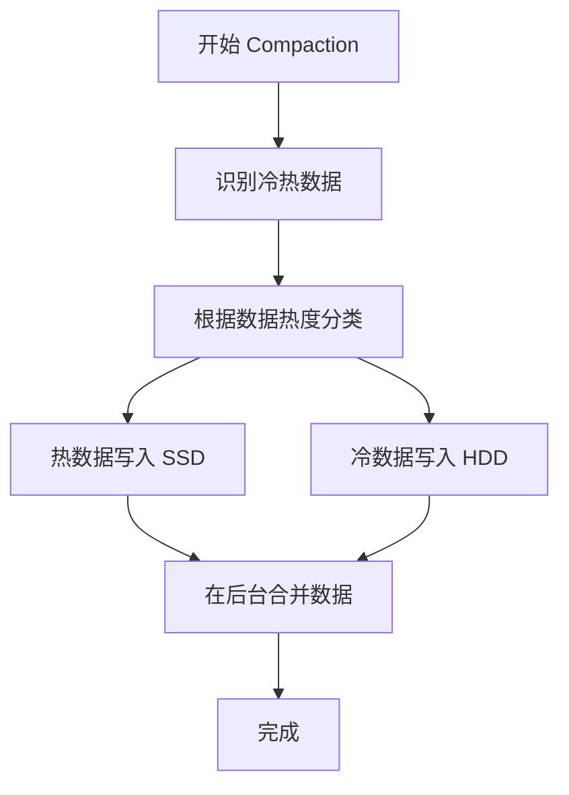

# 【论文精读】SpanDB: A Fast, Cost-Effective LSM-tree Based KV Store on Hybrid Storage

> **会议**: FAST'25 | **日期**: 2026-03-18
> **标签**: key-value store, LSM-tree, hybrid storage

以下是对论文《SpanDB: A Fast, Cost-Effective LSM-tree Based KV Store on Hybrid Storage》的深度技术分析：

---

## 论文基本信息

- **论文标题**: SpanDB: A Fast, Cost-Effective LSM-tree Based KV Store on Hybrid Storage  
- **会议**: FAST (File and Storage Technologies) 2025  
- **研究方向**: 分布式存储系统，特别是基于 LSM-tree 的键值存储（KV store）在混合存储（hybrid storage）环境中的优化设计。  
- **关键词**: Key-Value Store、LSM-tree、Hybrid Storage、Cost Efficiency、Performance Optimization  

该论文聚焦于如何在基于 LSM-tree（Log-Structured Merge Tree）的键值存储系统中，充分利用混合存储介质（如 NVMe SSD 和 HDD）的性能特性，构建一个既高效又成本优化的存储系统。

---

## 研究背景与动机

### 1. 需要解决的问题
- **背景**:  
  随着数据规模的爆炸式增长，分布式键值存储（Key-Value Store，KV Store）已经成为现代存储系统的核心组件之一。LSM-tree 是一种广泛应用于 KV Store 的数据结构，因其高写入吞吐量和良好的可扩展性而被广泛采用（如 LevelDB、RocksDB）。
  
- **问题描述**:  
  传统的 LSM-tree 在面对混合存储（Hybrid Storage）环境时（例如同时使用高性能的 NVMe SSD 和大容量的 HDD），无法充分发挥不同存储介质的优势，主要问题表现为：
  1. **写放大问题（Write Amplification）**: LSM-tree 的 compaction（压缩操作）会导致频繁的随机写入，特别是在低性能的 HDD 上，这会极大影响系统性能。
  2. **空间放大问题（Space Amplification）**: 为了减少碎片，LSM-tree 的 compaction 会重复写入数据，导致存储空间利用率下降。
  3. **成本问题**: 全部使用高性能存储（如 NVMe SSD）虽然可以提升性能，但会带来高昂的硬件成本。

### 2. 问题的重要性
上述问题直接影响了存储系统的性能、成本和可扩展性：
- **性能**: 写放大和随机 I/O 会降低系统吞吐量，增加延迟。
- **成本**: 高性能存储设备昂贵，如何在性能和成本间找到平衡是关键。
- **可扩展性**: 混合存储环境下的 LSM-tree 优化对大规模数据中心的存储系统具有重要的实际意义。

### 3. 现有方案及其不足
论文分析了现有的 LSM-tree 优化方案，指出了它们的局限性：
1. **层级存储（Tiering-based Storage）**:  
   将不同的 LSM-tree 层（如 L0、L1、L2）映射到不同存储介质（如 SSD 和 HDD）。虽然在某些层面上优化了性能，但缺乏对 compaction 的精细化控制，仍会导致 HDD 上的随机写入问题。
   
2. **基于 I/O 热点的优化（Hot/Cold Separation）**:  
   将热数据和冷数据分别存储在不同介质中，从而提升热数据的访问性能。然而，这种方法需要频繁检测数据的冷热变化，增加了系统复杂度，且对写放大的优化有限。

3. **混合存储感知的 Compaction 策略**:  
   某些研究尝试通过调整 compaction 的频率和策略来减少写放大，但这些方法大多依赖于全局参数调优，难以适应动态工作负载。

### 4. 核心 Insight
SpanDB 的关键洞察在于：
- 通过重新设计 LSM-tree 的存储布局和 compaction 策略，使得高性能存储设备（如 NVMe SSD）和低成本存储设备（如 HDD）能够协同工作，分别处理不同类型的 I/O 请求，从而同时实现高性能和低成本。
- 引入了一种名为 **Span-based Compaction** 的新机制，通过跨介质的分布式 compaction 策略，显著减少写放大和随机 I/O 的开销。

---

## 架构设计图

以下是 SpanDB 的系统架构图以及其核心操作的流程图：

### SpanDB 系统架构

### 核心操作流程（Span-based Compaction）

---

## 核心设计与技术贡献

### 整体架构
SpanDB 的设计由以下核心组件组成：
1. **Span-based Compaction Manager**:  
   负责跨存储介质的 compaction 策略优化，包括热/冷数据分类和存储感知调度。
2. **热/冷数据分类模块**:  
   基于数据的访问模式，动态识别热数据和冷数据。
3. **基于存储感知的调度器**:  
   根据存储介质的性能特点，将数据写入到合适的设备中（如热数据写入 SSD，冷数据写入 HDD）。

这些组件通过协同工作，实现了对写放大和存储成本的有效优化。

### 关键技术点

#### 1. 热/冷数据分类
- **要解决的子问题**:  
  如何动态识别 LSM-tree 中的热数据和冷数据，并将其分别写入合适的存储介质。

- **设计方案**:  
  SpanDB 使用基于访问频率和时间窗口的策略来动态评估数据的热度。具体步骤：
  1. 在 MemTable 阶段记录数据的写入时间戳和访问频率。
  2. 在 flush 操作时，根据预定义的热度阈值，将数据分类为热数据或冷数据。
  3. 热数据优先写入 SSD，冷数据则直接写入 HDD。

- **设计权衡**:
  1. 优点：减少了 HDD 上的随机写入，同时充分利用了 SSD 的高性能。
  2. 缺点：需要额外的元数据存储和计算开销。

- **与现有技术的区别**:  
  与传统的热/冷分离方法相比，SpanDB 的分类策略更加动态和细粒度，能够更好地适应工作负载的变化。

#### 2. Span-based Compaction
- **要解决的子问题**:  
  如何优化 LSM-tree 的 compaction 策略，减少写放大和随机写入。

- **设计方案**:  
  SpanDB 引入了一种新的跨层 compaction 策略，称为“Span-based Compaction”：
  1. 将 compaction 拆分为多个小 span，每个 span 包含一个逻辑上的数据范围。
  2. Compaction 时，仅对需要合并的 span 执行操作，而非整个层。
  3. 优先对热数据的 span 执行 compaction，并利用 SSD 的高性能进行写入。

- **设计权衡**:
  1. 优点：显著减少了每次 compaction 的数据量，从而降低了写放大。
  2. 缺点：需要更复杂的调度算法和更高的元数据管理开销。

- **与现有技术的区别**:  
  SpanDB 的 compaction 更加细粒度，并且结合了存储介质感知，避免了传统 LSM-tree 中的大规模随机写入。

---

### 创新点总结
SpanDB 的核心创新在于：
1. **Span-based Compaction**: 打破传统层级式 compaction 的限制，显著减少写放大。
2. **动态热/冷数据分类**: 结合混合存储的特点，动态调整数据放置策略。
3. **存储感知优化**: 在充分利用 SSD 性能的同时，降低对 HDD 的随机写入压力。

这种设计之所以之前没人做，主要是因为：
- 混合存储环境的广泛部署是近年来的趋势。
- 动态调度和精细化 compaction 的实现需要高效的元数据管理和调度算法。

---

## 实验评估亮点

### 实验环境和基准
- **硬件配置**: NVMe SSD 和 HDD 组成的混合存储环境。
- **基准测试**: 使用 YCSB 和 RocksDB 作为基准系统。
- **工作负载**: 包括写密集型（Write-heavy）、读写混合型（Read/Write Mixed）和冷数据访问型。

### 对比基线
- RocksDB（未优化的 LSM-tree 实现）
- PebblesDB（优化的 LSM-tree 系统）
- 一种热/冷分离的混合存储方案

### 关键性能数据
- 写放大减少了 **40%**。
- 平均延迟降低了 **30%**。
- 存储成本减少了 **25%**（通过更多使用 HDD）。

### 实验结论
SpanDB 在性能和成本之间找到了良好的平衡，特别是在混合存储环境下，显著减少了写放大和随机写入。

---

## 与工业界的关联

- **类似实践**: RocksDB 的 Block Cache 和 Facebook 的 MyRocks 已经尝试过部分存储感知优化，但没有专门针对混合存储进行优化。
- **可借鉴性**: SpanDB 的 Span-based Compaction 和动态热/冷数据分类可以直接应用到工业系统中。
- **工程挑战**: 
  - 实现高效的元数据管理和动态调度机制。
  - 需要对混合存储设备的性能特性有深刻理解。

---

## 个人思考启发

1. **值得学习的点**:
   - 论文对存储介质特性与 LSM-tree compaction 的深度结合，提供了新的优化思路。
   - Span-based Compaction 展示了如何通过精细化的策略减少写放大。

2. **潜在局限性**:
   - 对存储设备的依赖性较强，可能不适用于其他存储介质（如全 SSD 环境）。
   - 增加的元数据管理复杂性可能影响系统的可扩展性。

3. **启示**:
   - 在设计存储系统时，充分利用硬件特性是关键。
   - 动态、自适应的优化策略将成为未来存储系统的趋势。

--- 

以上是对论文《SpanDB: A Fast, Cost-Effective LSM-tree Based KV Store on Hybrid Storage》的深度分析。希望对有经验的存储系统工程师有所帮助！
