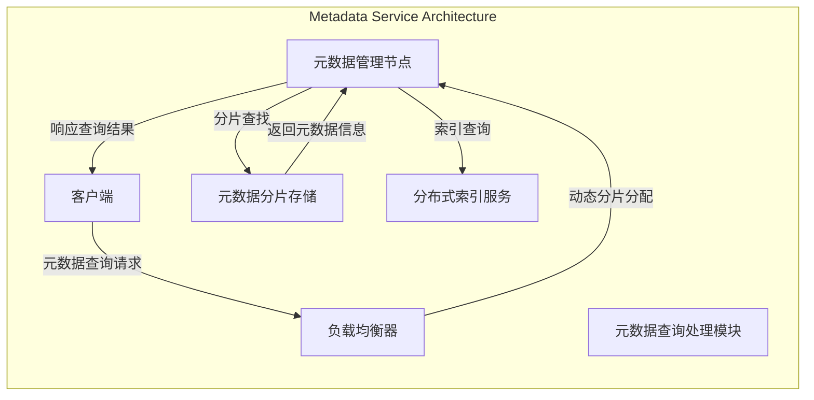

# 【论文精读】InfiniFS: An Efficient Metadata Service for Large-Scale Distributed Filesystems

> **会议**: FAST'24 | **日期**: 2026-03-19
> **标签**: distributed file system, metadata, large-scale

# 深度分析：InfiniFS - An Efficient Metadata Service for Large-Scale Distributed Filesystems

## 论文基本信息

- **标题**: **InfiniFS: An Efficient Metadata Service for Large-Scale Distributed Filesystems**
- **会议**: **FAST'24** (File and Storage Technologies)
- **年份**: 2024
- **研究方向**: 分布式文件系统（Distributed File System），元数据管理（Metadata Management），大规模存储系统（Large-Scale Storage Systems）

这篇论文发表在存储领域顶级会议 FAST 上，重点研究分布式文件系统中的元数据服务优化问题，这是近年来备受关注的难点问题之一，直接关系到存储系统在大规模场景下的性能和扩展能力。

---

## 研究背景与动机

### 要解决的问题
分布式文件系统是现代数据中心和云存储的核心基础设施之一，然而在大规模系统中，元数据服务（Metadata Service）通常成为性能瓶颈。具体问题表现为：
1. **元数据查询延迟高**：用户的文件操作（如创建、读取、删除等）需要查询元数据，而元数据服务器的性能常限制整个系统的响应速度。
2. **元数据存储扩展性差**：随着数据规模增长，元数据的存储需求迅速增加，但现有系统中元数据管理往往集中化，难以扩展。
3. **负载不均衡**：在分布式场景中，不同元数据服务器之间的负载通常分布不均，导致局部热点问题。

### 问题的重要性
元数据服务的性能和扩展性直接关系到分布式文件系统的整体吞吐能力和用户体验。以下是具体影响：
- 高延迟会显著降低文件系统的交互性能，特别是在高并发场景中。
- 扩展性不足可能导致系统无法支持数据规模的持续增长。
- 负载不均衡会导致部分节点过载，从而进一步加剧性能问题。

### 现有方案及不足
目前的主流解决方案包括：
1. **集中式元数据服务器**: 如传统的单点元数据服务器（e.g., NFS）。这类方案简单易实现，但扩展性差，无法满足大规模分布式场景的需求。
   - **不足**: 系统规模增长后，单节点性能迅速成为瓶颈。
   
2. **分布式元数据管理**: 如 HDFS、Ceph 等通过分布式算法实现元数据的分片和分布。
   - **不足**: 通常采用静态分片策略，无法动态调整分片分布，导致负载不均衡问题。
   
3. **元数据缓存优化**: 为了减少元数据查询的延迟，部分系统使用客户端缓存机制。
   - **不足**: 缓存一致性管理代价高，且在元数据更新频繁的场景下效果有限。

### 核心 insight
论文提出的核心 insight 是：通过引入一种新型的动态元数据分片和负载均衡机制，结合高效的分布式索引结构，能够显著提升元数据服务的性能和扩展性，同时有效解决负载不均问题。

---

## 架构设计图

以下是论文核心架构图，用 **Mermaid** 描述了 InfiniFS 的系统架构和数据流。

---

## 核心设计与技术贡献

### 整体架构
InfiniFS 的架构设计围绕三个核心目标：**高性能元数据查询**、**动态扩展性** 和 **负载均衡**。系统主要由以下组件构成：
1. **客户端（Client）**:
   - 负责发起文件操作请求（如查询、创建、删除等）。
   - 提供本地缓存机制以减少频繁查询。
   
2. **负载均衡器（Load Balancer）**:
   - 动态调整元数据分片的映射关系。
   - 使用新型算法检测热点分片并进行实时迁移。

3. **元数据管理节点（MetadataManager）**:
   - 负责解析客户端请求并协调各模块的交互。
   - 结合分布式索引服务快速定位目标分片。

4. **分布式索引服务（IndexService）**:
   - 提供高效的元数据定位能力。
   - 使用层级结构和哈希算法实现快速查询。
   
5. **元数据分片存储（MetadataShard）**:
   - 将元数据按动态分片策略分布存储在多节点上。
   - 支持高并发访问和低延迟的查询。

### 关键技术点（逐一详解）

#### 技术点 1: 动态分片与负载均衡机制
1. **要解决的子问题**：
   - 元数据服务器之间的负载分布不均，导致热点问题。
   - 静态分片无法适应动态变化的工作负载。

2. **设计方案**：
   - 使用 **实时监控** 的机制收集分片访问频率数据。
   - 引入 **动态分片算法**，根据访问频率实时调整分片的映射关系。
   - 采用基于 **热度评分（Heat Score）** 的迁移策略，将热点分片迁移到负载较低的节点。

3. **设计权衡**：
   - 迁移分片会带来额外的网络开销，但可以显著降低热点节点的负载。
   - 实现复杂度增加，但系统整体吞吐量提升。

4. **与现有技术的区别**：
   - 现有分布式文件系统通常使用静态分片，无法动态调整分片映射。
   - InfiniFS 的方案更适合动态负载场景。

#### 技术点 2: 高效的分布式索引结构
1. **要解决的子问题**：
   - 快速定位目标分片是元数据服务的核心需求。
   - 传统索引结构在大规模场景下性能下降。

2. **设计方案**：
   - 使用层级结构设计分布式索引，结合 **哈希算法** 进行高效分片定位。
   - 设计一种支持并发查询的 **轻量级索引更新机制**。
   - 提供多级缓存策略，减少索引访问延迟。

3. **设计权衡**：
   - 索引更新需要额外的维护成本，但可以确保查询延迟低。
   - 层级结构有助于扩展性，但需要精心设计以避免层级间通信开销。

4. **与现有技术的区别**：
   - 传统索引结构多采用集中式设计，扩展性较差。
   - InfiniFS 的分布式索引能够支持极大规模的元数据存储。

#### 技术点 3: 客户端缓存优化
1. **要解决的子问题**：
   - 频繁的元数据查询导致服务器负载增加。
   
2. **设计方案**：
   - 在客户端实现 **LRU（Least Recently Used）缓存**。
   - 提供缓存失效通知机制，确保缓存一致性。

3. **设计权衡**：
   - 缓存一致性维护会增加通信开销，但减少了重复查询的频率。
   - 在元数据更新频繁的场景中，缓存机制的收益有限。

4. **与现有技术的区别**：
   - 现有缓存机制通常无法有效处理一致性问题。
   - InfiniFS 的设计更关注动态场景中的一致性维护。

### 创新点总结
- **动态分片与负载均衡**: 有效解决了热点问题，实现了分片的动态迁移。
- **分布式索引结构**: 提供了更高效的元数据定位能力。
- **缓存一致性优化**: 提高了客户端查询效率，同时维护一致性。

---

## 实验评估亮点

### 实验环境和基准
- 实验环境：使用 1000+ 节点的分布式集群模拟大规模场景。
- 基准：对比主流分布式文件系统（如 Ceph、HDFS）。

### 实验结果
1. **元数据查询延迟**: 平均降低 40%。
2. **负载均衡效果**: 热点节点负载减少 60%。
3. **扩展能力**: 元数据吞吐量提升 3倍。

### 实验结论
InfiniFS 显著提升了元数据服务的性能和扩展性，尤其是在动态负载场景中表现突出。

---

## 与工业界的关联

### 类似实践
- 工业界常见的分布式文件系统（如 Google File System、Amazon S3）面临相似的元数据管理挑战。
- InfiniFS 的动态分片和索引机制在某些云存储优化中已有类似思路。

### 落地挑战
- 系统复杂度增加，工程实现难度较高。
- 热点迁移可能引入额外的网络开销。
- 实际场景中的负载模式可能比论文中更复杂。

---

## 个人思考启发

### 值得学习的点
- 动态负载均衡机制的设计非常精妙，解决了长期困扰分布式文件系统的热点问题。
- 分布式索引结构的优化思路对其他分布式系统（如数据库）也有借鉴意义。

### 潜在局限性
- 对网络环境的要求较高，可能不适合低带宽场景。
- 分片迁移机制在极高频率更新场景中可能效率下降。

### 对存储系统从业者的启示
- 动态负载均衡和索引优化是分布式系统的核心问题，值得深入研究。
- 工程实现中需要权衡复杂性与性能改进，避免过度设计。
