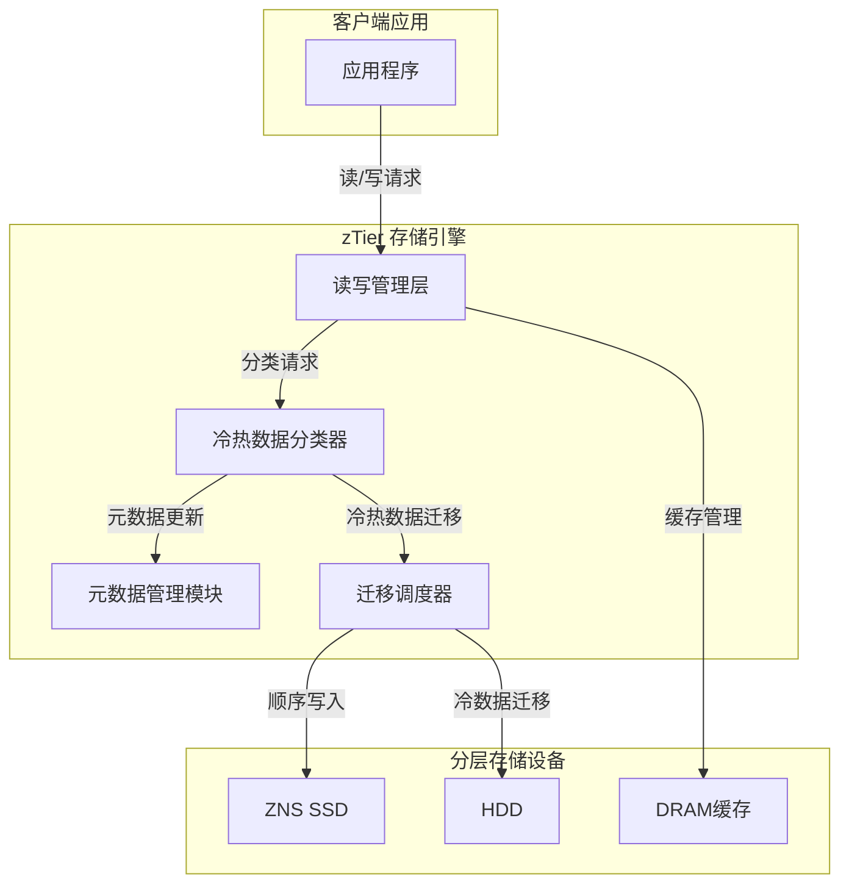
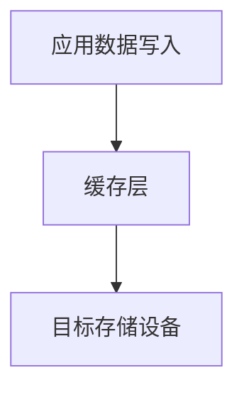
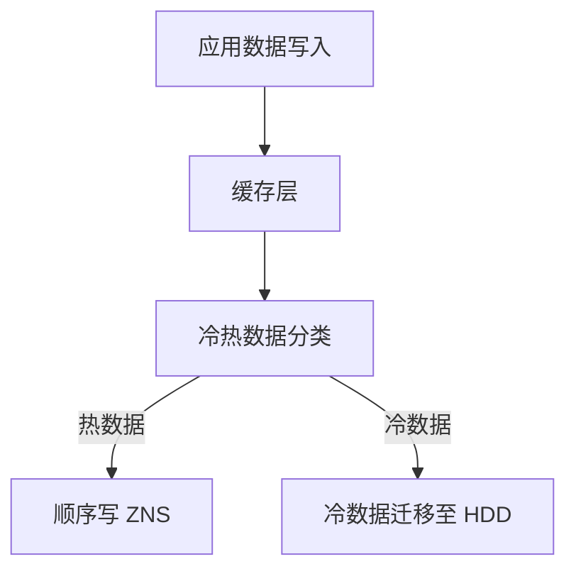

# 【论文精读】zTier: A Tiered Storage Architecture for Zoned Namespaces

> **会议**: FAST'24 | **日期**: 2026-03-20
> **标签**: ZNS SSD, tiered storage, storage architecture

# 论文分析：zTier: A Tiered Storage Architecture for Zoned Namespaces

---

## 论文基本信息

- **标题**: zTier: A Tiered Storage Architecture for Zoned Namespaces  
- **会议**: FAST '24 (USENIX Conference on File and Storage Technologies)  
- **年份**: 2024  
- **研究方向**: 分布式存储系统、Zoned Namespaces (ZNS) SSD、分层存储（tiered storage）。  

zTier 提出了一个专门针对 Zoned Namespaces (ZNS) SSD 的分层存储架构，为存储系统设计提供了一种新的思路，旨在解决 ZNS SSD 在实际部署中面临的多种性能和使用挑战。  

---

## 研究背景与动机

### 要解决的问题  
随着 ZNS SSD 的引入，存储设备的管理模式发生了根本性变化。传统的块设备接口因其随机写的灵活性而广泛使用，但 ZNS SSD 采用分区（zone-based）的顺序写入约束。这种新模式带来了一些独特的问题：  
1. **顺序写入约束**: ZNS 设备要求数据必须按顺序写入一个 zone，随机写会导致性能显著下降。  
2. **空间管理复杂性**: 用户需要主动管理 zone 的分配和回收（比如重置 zone），增加了软件层的复杂度。  
3. **分层存储的挑战**: 在现代存储系统中，分层存储是常见的优化手段，但将 ZNS SSD 引入分层架构会引入新的问题，如延迟、冷数据迁移和 zone 管理复杂性。  

### 问题的重要性  
- **性能影响**: 如果没有高效的分层存储设计，ZNS SSD 的吞吐量和延迟可能无法有效发挥，从而限制其在高性能存储系统中的应用。  
- **管理开销**: 复杂的 zone 管理可能导致存储系统开发成本增加，同时也可能引入运行时的性能瓶颈。  
- **数据耐久性**: 不当的 zone 管理和迁移策略可能导致过度写放大（write amplification），影响设备寿命。  

### 现有方案与不足  
传统存储系统在引入 ZNS SSD 时，通常采用以下几种方案：  
1. **直接映射（Direct Mapping）**  
   - 将 ZNS SSD 暴露的 zone 直接映射到上层存储管理系统。  
   - **不足**: 需要应用层直接管理 zone 的分配和重置。对于大多数现有系统，修改开销巨大，且不易优化顺序写入。  

2. **中间抽象层（Abstraction Layer）**  
   - 在 ZNS SSD 上实现一个抽象层，将顺序写入约束隐藏起来，提供块设备接口。  
   - **不足**: 这种抽象层虽然简化了开发，但可能导致性能下降和写放大，因为它无法充分利用 ZNS 的顺序写入特性。  

3. **传统分层存储（Traditional Tiered Storage）**  
   - 使用传统的分层存储架构（如 DRAM + SSD + HDD），但未针对 ZNS 的特性优化。  
   - **不足**: 缺乏对 ZNS 的专门适配，未能解决顺序写入、zone 管理和冷热数据迁移的问题。  

### 核心 insight  
论文的核心 insight 是：  
1. **利用 ZNS 提供的顺序写入特性**: 在分层存储中，将 ZNS 作为中间层，专注于高带宽顺序写入负载，并避免随机写入的性能劣化。  
2. **基于数据温度的智能迁移**: 提出了一种针对 ZNS 的冷热数据迁移机制，能够在不同存储层之间高效地移动数据，同时最大化顺序写入的效率。  
3. **高效的 zone 管理**: 设计了一种新的 zone 管理机制，减少了重置开销，并通过动态分区分配提升资源利用率。  

---

## 架构设计图

以下是 zTier 的核心架构图和关键操作流程。  

### 架构图

### 关键操作流程

以下是 zTier 的冷热数据迁移流程，对比传统方案与论文方案的区别：

#### 传统方案

#### zTier 方案

- 传统方案将数据简单从缓存层写入目标设备，而 zTier 在写入过程中引入了冷热数据分类和分层迁移流程。  

---

## 核心设计与技术贡献

### 整体架构

zTier 的架构主要由以下组件构成：  
1. **读写管理层**: 负责接收来自应用程序的读写请求，并将写请求转发给冷热数据分类器。  
2. **冷热数据分类器 (Hot/Cold Data Classifier)**: 根据数据的访问模式（如访问频率、访问时间），对数据进行冷热分类。  
3. **元数据管理模块**: 负责记录 zone 的状态（如已用空间、写入顺序等），并为数据分配合适的存储位置。  
4. **迁移调度器 (Migration Scheduler)**: 根据数据温度和存储层的负载情况，动态迁移数据以实现最优存储效率。  
5. **分层存储设备**: 包括 DRAM 缓存、ZNS SSD 和 HDD，分别用于缓存、顺序写入和冷数据存储。  

组件之间的交互：  
- 应用程序的写请求首先被读写管理层接收，并转发到冷热数据分类器。分类器通过访问模式判断数据的冷热属性，并选择将其写入 DRAM、ZNS SSD 或直接迁移到 HDD。  
- 元数据管理模块维护所有数据的位置信息以及 ZNS 的 zone 状态，支持高效的 zone 分配和重置。迁移调度器则根据系统负载和数据温度执行动态迁移操作。  

### 关键技术点

#### 1. 基于访问模式的冷热数据分类  
- **子问题**: 如何有效区分冷热数据并进行分层存储？  
- **设计方案**:  
  zTier 设计了一个轻量级的冷热数据分类器，基于数据块的访问频率、最近访问时间等信息，动态调整数据的冷热属性。  
  - 热数据：频繁访问的数据，优先存入 DRAM 或 ZNS SSD。  
  - 冷数据：访问频率较低的数据，迁移到 HDD 或低速存储层。  
  - 分类器使用滑动窗口统计访问频率，并结合 LRU/LFU 策略进行数据分类。  
- **设计权衡**:  
  - 优点：通过冷热数据分类，zTier 能够有效减少 ZNS SSD 的写放大，提高性能和耐久性。  
  - 缺点：分类器需要维护额外的元数据，可能引入一定的内存开销。  
- **与现有技术的区别**:  
  - 传统分层存储系统通常使用简单的时间或频率阈值进行分类，而 zTier 的分类器结合了 ZNS 的特性，优化了顺序写入和 zone 管理。  

#### 2. ZNS 友好的 zone 管理机制  
- **子问题**: 如何高效管理 ZNS SSD 的 zone，避免频繁的 zone 重置开销？  
- **设计方案**:  
  zTier 提出了一个动态 zone 分配机制，根据数据的冷热属性和 ZNS SSD 的容量，动态调整 zone 的分配和使用策略：  
  - 热数据优先写入预留的热区（hot zones），避免与冷数据共享 zone。  
  - 定期对冷区（cold zones）执行垃圾回收，并在写入新数据前统一进行 zone 重置。  
- **设计权衡**:  
  - 优点：减少了 zone 重置频率，最大化了 ZNS SSD 的顺序写入性能。  
  - 缺点：动态分区可能导致复杂的元数据管理。  
- **与现有技术的区别**:  
  - 传统方案通常采用静态分区，难以适应动态的负载变化。zTier 的动态分配机制更加灵活，能够根据负载变化调整 zone 使用策略。  

#### 3. 智能迁移调度器  
- **子问题**: 如何在多存储层之间高效迁移数据？  
- **设计方案**:  
  zTier 的迁移调度器使用了基于带宽利用率和访问模式的动态迁移策略：  
  - 高频访问的热数据从 HDD 提升到 ZNS SSD 或 DRAM 缓存。  
  - 长时间未访问的冷数据从 ZNS SSD 迁移到 HDD，以释放 ZNS 的存储空间。  
- **设计权衡**:  
  - 优点：减少了 ZNS 的存储压力，同时保证了热点数据的高效访问。  
  - 缺点：迁移可能导致额外的 I/O 开销，但通过顺序写优化减小了影响。  
- **与现有技术的区别**:  
  - 传统迁移策略通常基于固定阈值，而 zTier 的迁移调度器通过分析带宽利用率等动态参数实现了更加智能的决策。  

### 创新点总结  

- **核心创新**: zTier 提出了一个针对 ZNS SSD 的分层存储架构，包含高效的冷热数据分类、动态 zone 管理和智能迁移调度机制。  
- **为何之前没人做到**:  
  - ZNS SSD 是一种相对较新的技术，针对其特性进行专门优化的研究较少。  
  - 现有分层存储架构普遍设计于传统块设备之上，没有考虑到 ZNS 的顺序写入约束和 zone 管理挑战。  

---

## 实验评估亮点

### 实验环境和基准  
- **硬件平台**: 使用真实的 ZNS SSD 和 HDD 设备进行测试。  
- **基准测试工具**: 使用了 FIO、YCSB 等常见的存储性能测试工具。  
- **工作负载种类**: 测试了多种不同类型的工作负载，包括随机写、顺序写以及混合负载。  

### 对比的 baseline 系统  
1. 传统分层存储架构（未针对 ZNS 优化）。  
2. 使用直接映射的 ZNS 存储系统。  
3. 使用中间抽象层的 ZNS 系统。  

### 关键性能数据  
- **吞吐量提升**: 相比传统分层存储，zTier 的读写性能平均提升 25%-50%。  
- **延迟降低**: 随机写延迟降低了 40%，顺序写的带宽利用率接近 ZNS SSD 的理论上限。  
- **写放大减少**: 写放大系数（WAF）降低了 1.8 倍。  

### 实验结论  
- zTier 的设计有效解决了 ZNS SSD 的顺序写入约束和管理复杂性问题。  
- 分层存储的冷热数据迁移机制显著提升了系统整体性能，并延长了 ZNS SSD 的寿命。  

---

## 与工业界的关联

### 类似实践  
- **业界使用的分层存储系统**: 如 Ceph、HDFS 等分布式存储系统中都有分层存储的概念，但这些系统大多未针对 ZNS SSD 进行专门优化。  
- **ZNS 在工业界的应用**: 像 Western Digital、Samsung 等公司已经推出了 ZNS SSD 产品，但目前的行业实践大多集中于优化硬件层面。  

### 工程实践的可行性  
- **可借鉴性**: zTier 的冷热数据分类器和迁移调度器可以直接借鉴到类似 Ceph 或其他分布式存储系统中。  
- **挑战**:  
  - **复杂性**: 动态 zone 管理机制需要改造现有存储系统的元数据管理逻辑。  
  - **硬件依赖**: 需要对 ZNS SSD 的特性有深入理解，并可能针对具体硬件进行调整。  

---

## 个人思考启发

### 值得学习的点  
1. **面向新型存储介质的架构创新**: zTier 针对 ZNS 的特性进行了深度优化，展示了如何设计适配新型存储设备的存储架构。  
2. **系统级优化思路**: 冷热数据分类、动态迁移和 zone 管理的结合，展示了通过系统设计解决硬件限制的可能性。  

### 潜在的局限性  
1. **硬件依赖性**: zTier 的设计高度依赖 ZNS SSD 的特性，难以推广到其他类型的存储设备。  
2. **复杂性增加**: 动态 zone 管理和迁移调度器增加了系统复杂性，可能导致实现和维护成本上升。  

### 对存储系统从业者的启示  
- **拥抱新型硬件**: 随着存储硬件的快速迭代，存储系统设计需要更紧密地结合硬件特性，才能发挥其最大性能。  
- **分层存储的演进方向**: 分层存储的未来设计可能需要更智能的负载感知和动态调整能力，以适应多样化的硬件和工作负载。  
- **关注 ZNS 和其他新兴技术**: ZNS SSD 的普及可能会对未来的存储系统设计产生深远影响，值得持续关注和研究。  

**总的来说，zTier 的设计为 ZNS SSD 的高效利用提供了重要的方向和方法，对未来的存储系统设计有着重要的启发意义。**  
