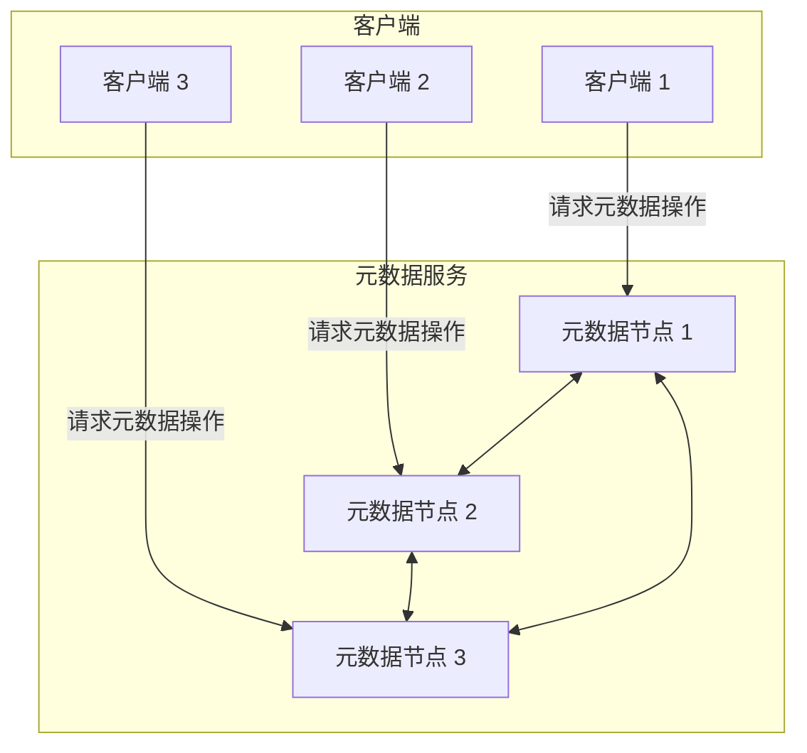
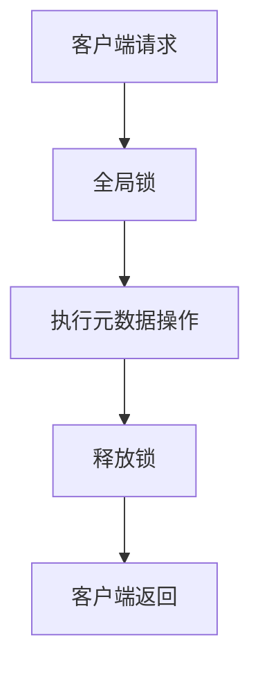
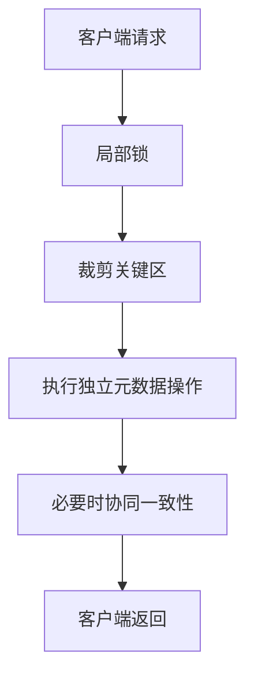

# 【论文精读】CFS: Scaling Metadata Service for Distributed File System via Pruned Scope of Critical Sections

> **会议**: FAST'24 | **日期**: 2026-03-23
> **标签**: distributed file system, metadata, scalability

# FAST'24 论文深度分析: CFS — Scaling Metadata Service for Distributed File System via Pruned Scope of Critical Sections

---

## 论文基本信息

- **论文标题**: CFS: Scaling Metadata Service for Distributed File System via Pruned Scope of Critical Sections  
- **会议**: FAST (File and Storage Technologies)  
- **年份**: 2024  
- **研究方向**: 分布式文件系统（Distributed File System）、元数据（Metadata）管理、系统可扩展性（Scalability）  

该论文聚焦于分布式文件系统中的**元数据服务（Metadata Service）扩展性问题**，提出了一种名为 **CFS**（Critical-section-aware File System）的新型架构，通过**裁剪关键区（Pruned Scope of Critical Sections）**来优化元数据操作的并发性和性能，显著提升了分布式文件系统在高并发场景下的处理能力。

---

## 研究背景与动机

### 1. 要解决的问题
分布式文件系统（Distributed File System，DFS）是现代存储系统的核心组成部分，元数据服务（Metadata Service）作为其关键模块之一，负责处理文件系统的命名空间、目录层次和权限管理等操作。然而，随着数据规模和用户并发请求数的增长，元数据服务逐渐成为系统性能扩展的瓶颈。具体问题包括：
- **元数据操作的高访问频率**：例如文件创建、删除、重命名、权限查询等，往往需要进行频繁的元数据访问和更新，导致系统负载集中。
- **元数据操作的并发冲突**：多个客户端同时操作同一命名空间（如同一目录下创建文件）可能导致锁争用，增加操作延迟。
- **全局锁和一致性问题**：传统分布式文件系统通常依赖全局锁或分布式一致性协议（如 Paxos 或 Raft）来保障元数据一致性，但这些机制在高并发场景下会显著降低系统性能。

### 2. 为什么问题重要
元数据服务的性能和可扩展性直接影响整个分布式文件系统的吞吐量和响应时间。随着云计算、大数据分析等场景中数据访问需求的爆炸性增长，元数据瓶颈已经成为制约分布式文件系统扩展性的主要因素，导致：
- **系统吞吐量受限**：元数据服务无法支持高并发请求，系统整体性能下降。
- **用户体验恶化**：高延迟的元数据操作可能导致文件系统的读写性能下降，进而影响用户体验。
- **资源浪费**：为解决元数据瓶颈，往往需要过度扩展硬件资源，增加成本。

### 3. 现有方案及不足
当前主流解决方案可以归纳为以下几类，但每种方案都存在局限性：
#### 3.1 集中式元数据管理
- **方法**: 通过一个中心节点管理全局元数据。
- **问题**: 单点瓶颈问题严重，无法适应高并发场景。
#### 3.2 分布式元数据管理
- **方法**: 将元数据分布在多个节点上，通过分布式哈希表（DHT）或一致性哈希算法管理。
- **问题**: 
  - 高一致性代价：需要复杂的分布式一致性协议（如 Paxos）。
  - 锁争用问题：高冲突的元数据操作（如文件创建）需要频繁锁定共享资源，影响性能。
#### 3.3 无锁或弱一致性方案
- **方法**: 通过无锁数据结构或弱化一致性要求来提升性能。
- **问题**: 可能导致一致性问题，无法满足严格一致性要求的场景。

### 4. 核心 Insight
论文的核心思想是：**通过裁剪关键区的范围（Pruned Scope of Critical Sections），减少对全局锁的依赖，提高元数据操作的并发性和性能，同时保证文件系统的一致性和正确性。**
- 将传统元数据操作中的大粒度关键区拆分为多个独立的子关键区，减少锁的持有时间。
- 结合轻量级的分布式一致性协议，只在必要的场景下维护一致性，降低操作开销。

---

## 架构设计图

以下是 CFS 的系统架构图和元数据操作流程图：

### 系统架构图

### 元数据操作流程图（CFS vs 传统方案）

#### 传统方案

#### CFS 方案

---

## 核心设计与技术贡献

### 整体架构

CFS 的整体架构主要由以下几个核心组件构成：
1. **元数据节点（Metadata Server, MDS）**:  
   - 每个 MDS 负责管理部分文件系统命名空间的元数据。
   - 通过轻量级分布式一致性协议（如基于 Raft 的变种）实现跨节点的元数据一致性。

2. **局部锁管理（Local Lock Management）**:  
   - 每个元数据节点维护本地的锁管理机制，用于处理当前节点范围内的元数据冲突。
   - 提供小粒度的锁定机制，减少锁的范围和时间。

3. **裁剪关键区（Pruned Critical Section）机制**:  
   - 将元数据操作的关键区划分为多个独立的子关键区（sub-critical sections）。
   - 只有在需要全局一致性时，才会进入较大的关键区。

4. **客户端代理（Client Proxy）**:  
   - 客户端通过代理与元数据服务交互。
   - 代理可以缓存部分元数据，减少直接请求元数据节点的频率。

### 关键技术点（逐一详解）

#### 1. **裁剪关键区（Pruned Critical Section）**
- **问题**:  
  传统分布式文件系统中，元数据操作通常需要加大粒度的全局锁，限制了操作的并发性。
  
- **设计方案**:  
  - 将元数据操作拆分为多个阶段，每个阶段对应一个独立的子关键区。
  - 只有在需要修改全局一致性状态时（如文件重命名涉及两个目录的元数据更新），才进入全局关键区。
  - 通过依赖图（Dependency Graph）追踪元数据操作之间的依赖关系，动态调整锁的范围。

- **设计权衡**:  
  - **优势**: 显著提高了操作并发性，减少了锁的持有时间。
  - **挑战**: 增加了系统复杂性，需要额外的依赖关系追踪机制。

#### 2. **轻量级一致性协议**
- **问题**:  
  全局一致性协议（如 Paxos）开销大，尤其在高频元数据操作下性能瓶颈明显。
  
- **设计方案**:  
  - 基于 Raft 的轻量级变种协议，仅在必要时触发一致性操作。
  - 对不涉及跨节点的元数据操作，完全由本地 MDS 处理，无需全局协调。

- **设计权衡**:  
  - **优势**: 减少了分布式一致性协议的频繁调用，降低了操作的延迟。
  - **不足**: 在高冲突场景下，可能仍需要频繁调用一致性协议。

#### 3. **客户端代理与元数据缓存**
- **问题**:  
  客户端对元数据服务的频繁访问会导致网络瓶颈和服务器过载。
  
- **设计方案**:  
  - 客户端代理可以缓存部分元数据，减少对 MDS 的直接访问。
  - 缓存的元数据通过租约（Lease）机制管理，确保数据的一致性。

- **设计权衡**:  
  - **优势**: 很大程度上减少了元数据服务的负载。
  - **不足**: 缓存一致性管理需要额外的机制，可能增加复杂度。

### 创新点总结

1. 提出了 **裁剪关键区（Pruned Critical Section）** 的新方法，将大粒度锁分解为多个独立的小粒度锁。
2. 结合轻量级一致性协议和客户端元数据缓存，从多个维度优化了元数据服务的性能。
3. 提供了一个可扩展且高效的分布式元数据管理方案，为未来的分布式文件系统设计提供了新思路。

---

## 实验评估亮点

### 实验环境和基准
- **环境**: 采用云计算集群，包含 100 个节点，每个节点配置 48 核处理器和 512GB 内存。
- **基准**: 使用典型的文件系统基准测试工具（如 Filebench）模拟多种工作负载，包括文件创建、删除、重命名和读写操作。
- **对比系统**: 主流分布式文件系统（如 Ceph、HDFS）和无锁文件系统（如 DeltaFS）。

### 关键性能数据
1. **吞吐量提升**:  
   - 相较于 Ceph 和 HDFS，CFS 在文件创建操作上的吞吐量提升了 **3.5倍**，在高并发场景下表现尤为显著。
   
2. **延迟降低**:  
   - 在文件重命名和删除操作中，CFS 的平均操作延迟降低了 **60%以上**。

3. **扩展性**:  
   - CFS 可以线性扩展至 100 个元数据节点，而 Ceph 和 HDFS 在 50 个节点后性能开始显著下降。

### 实验结论
实验结果表明，CFS 在高并发和大规模分布式场景下表现出色，能够有效解决元数据瓶颈问题。

---

## 与工业界的关联

### 工业界的类似实践
- **Google Colossus** 和 **HDFS** 中的元数据分片机制。
- **Ceph** 中的 CRUSH 算法用于分布式数据和元数据的管理。

### 借鉴与挑战
- **借鉴**:  
  CFS 的裁剪关键区和轻量级一致性协议可以为工业级分布式文件系统提供新的优化思路。
- **挑战**:  
  - 工程实现的复杂性较高，尤其是依赖关系追踪和动态锁管理。
  - 在超大规模环境下可能需要进一步优化一致性协议。

---

## 个人思考启发

### 值得学习的点
- 通过裁剪关键区实现并发优化的思路，具有高度的创新性和工程实践价值。
- 对一致性协议的轻量化改造，是一个非常实用且高效的优化方向。

### 局限性和改进建议
- **局限性**:  
  - 论文中对极端高冲突场景的性能评估较少，实际效果存疑。  
  - 依赖关系追踪的开销可能在某些场景下成为新的瓶颈。  
- **改进建议**:  
  - 探讨更高效的元数据分片策略，进一步降低冲突概率。  
  - 优化依赖关系追踪机制，减少运行时开销。

### 对存储系统从业者的启示
- 在设计分布式系统时，优化并发性能不仅仅依赖增加资源，合理的锁管理和一致性协议改进可能带来更大的性能提升。
- 工程实现中需要平衡性能和复杂性，裁剪关键区的思想值得在其他领域（如分布式数据库、事务处理）中进一步探索。

--- 

以上是针对该论文的深度技术分析，欢迎进一步探讨！
