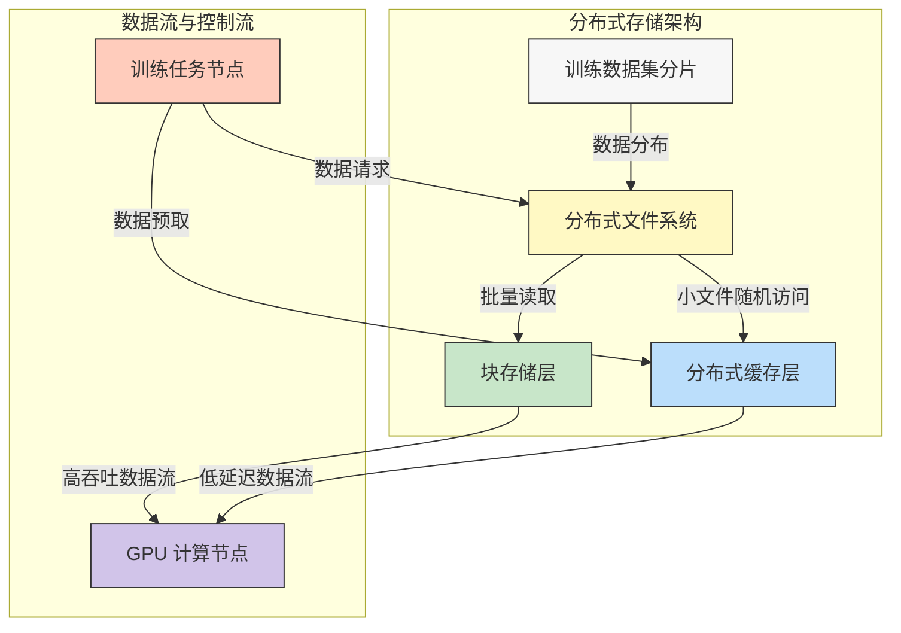
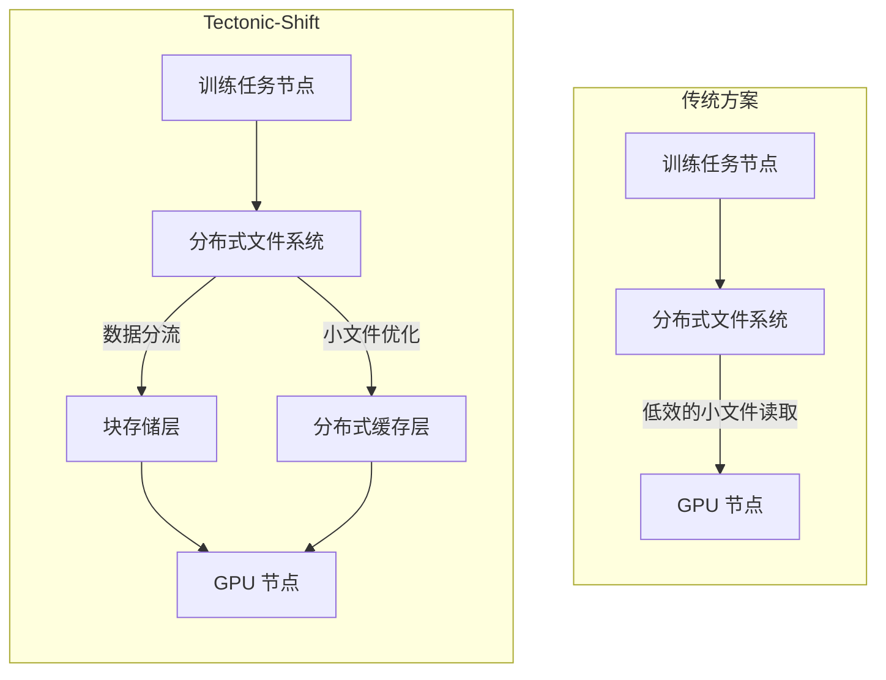

# 【论文精读】Tectonic-Shift: A Composite Storage Fabric for Large-Scale ML Training

> **会议**: FAST'24 | **日期**: 2026-03-24
> **标签**: distributed storage, ML training, large-scale

# 深度技术分析: `Tectonic-Shift: A Composite Storage Fabric for Large-Scale ML Training`

## 论文基本信息

- **标题**: Tectonic-Shift: A Composite Storage Fabric for Large-Scale ML Training  
- **会议**: FAST'24 (File and Storage Technologies Conference)  
- **年份**: 2024  
- **研究方向**: 分布式存储系统、大规模机器学习（ML）训练、数据密集型计算  

该论文聚焦于大规模机器学习训练场景中的存储系统设计，提出了一种新型的复合存储架构（Composite Storage Fabric），旨在解决大规模 ML 训练中存储效率和性能瓶颈问题。

---

## 研究背景与动机

### 问题描述

大规模机器学习训练（如深度学习模型的训练）对存储系统提出了以下挑战：

1. **数据吞吐量需求高**: 训练数据集规模通常以 TB 或 PB 为单位，且训练任务需要频繁读取这些巨大的数据集。
2. **I/O 访问模式复杂**: 数据访问模式包括批量读取（batch reads）、随机小文件读取（random small file access）和迭代访问（iterative access）。
3. **低延迟要求**: 训练过程中，计算资源（如 GPU）依赖于高效的数据流，否则可能出现计算资源闲置，导致浪费。
4. **数据一致性和分布问题**: 数据需要在分布式存储节点间一致地分布，以避免负载不均和数据热点。

### 问题的重要性

- **计算资源利用率**: ML 训练通常运行于高性能计算集群中，GPU 等计算资源成本高昂，任何存储延迟都会直接影响训练效率。
- **训练时间长**: 当前的大规模 ML 模型通常需要数小时甚至数天的训练时间，存储系统的瓶颈可能进一步拉长训练周期。
- **经济成本**: 存储系统的低效会增加硬件和运营成本，同时限制了大规模 ML 应用的普及。

### 现有方案分析

1. **分布式文件系统（如 HDFS, Ceph）**:  
   - 优点: 提供了可靠性和扩展性，支持分布式存储。  
   - 缺点: 面向通用场景设计，无法针对 ML 训练中高吞吐量、低延迟和复杂 I/O 模式优化。  
   
2. **块存储（如 Amazon S3, Google Cloud Storage）**:  
   - 优点: 提供了简单的对象接口和可扩展性。  
   - 缺点: 对于小文件的访问效率较低，且无法充分优化分布式 ML 训练的访问模式。  

3. **分布式缓存（如 Alluxio, Memcached）**:  
   - 优点: 提供了高性能的缓存支持，部分缓解了存储延迟问题。  
   - 缺点: 缓存层通常无法有效整合数据存储层，且缓存命中率低时性能受限。

### 核心 insight

论文提出的核心思路是：  
**利用一种复合存储架构（Composite Storage Fabric），结合分布式文件系统、块存储和缓存层的优势，针对 ML 训练场景设计优化的存储机制，从而实现高吞吐、低延迟的数据访问，同时支持复杂的 I/O 模式。**

---

## 架构设计图

以下是论文提出的 Tectonic-Shift 系统的架构图，用 Mermaid 语法绘制：

### 关键操作流程图

以下是传统存储方案和 Tectonic-Shift 的操作流程对比：

---

## 核心设计与技术贡献

### 整体架构

**系统核心组件**:
1. **分布式文件系统（Distributed File System）**:  
   - 主要负责存储训练数据集的大文件，提供高可靠性和扩展性。  
   - 提供数据分片和分布功能。  

2. **块存储层（Block Storage Layer）**:  
   - 专门优化批量数据读取场景，支持高吞吐的数据流传输。  

3. **分布式缓存层（Distributed Cache Layer）**:  
   - 负责优化随机小文件的访问和低延迟数据请求。  

4. **训练任务节点（Training Nodes）**:  
   - 运行 ML 模型训练任务，负责发起数据请求。  

5. **数据路由器（Data Router）**:  
   - 根据访问模式（批量读取 vs 小文件随机读取）智能分流数据请求到合适的存储层。

**组件交互**:  
训练任务节点通过数据路由器与分布式存储层交互，路由器根据请求类型将数据分流到块存储层或分布式缓存层。块存储层负责高吞吐的批量数据流，而缓存层则优化小文件的随机访问。

---

### 关键技术点

#### 技术点 1: 智能数据路由（Smart Data Routing）

1. **子问题**:  
   如何根据不同的访问模式（批量 vs 随机）动态选择最优存储层？  

2. **设计方案**:  
   数据路由器实现了基于访问模式的智能分流：  
   - 对于批量访问请求，路由器将数据流导向块存储层，利用其高吞吐特性。  
   - 对于随机小文件或低延迟请求，路由器将数据流导向分布式缓存层。

3. **设计权衡**:  
   - **优点**: 结合了两种存储层的优势，避免了传统存储系统在单一场景下的性能瓶颈。  
   - **缺点**: 数据路由器的设计复杂度增加，并且需要实时分析访问模式以决定分流策略。  

4. **与现有技术的区别**:  
   传统存储系统通常无法动态分流数据，只能依赖固定的存储层，而智能路由提供了更高的灵活性。

---

#### 技术点 2: 数据预取（Data Prefetching）

1. **子问题**:  
   如何减少 GPU 等训练资源的等待时间，提高数据的预加载效率？  

2. **设计方案**:  
   - 系统通过预测模型预估下一步可能需要的数据块，并提前加载到缓存层或块存储层。  
   - 结合 ML 训练的迭代特性，设计了专门的预取算法。

3. **设计权衡**:  
   - **优点**: 显著减少存储访问延迟，提升计算资源利用率。  
   - **缺点**: 需要额外的计算资源进行预测，且预测不准确时可能导致资源浪费。

4. **与现有技术的区别**:  
   传统预取机制通常基于简单的顺序访问模式，而该方案结合了 ML 训练的特定访问规律，预测更精准。

---

#### 技术点 3: 数据分片与分布（Data Sharding and Distribution）

1. **子问题**:  
   如何避免存储节点间负载不均，防止数据热点问题？  

2. **设计方案**:  
   - 使用一致性哈希（consistent hashing）算法对训练数据进行分片和分布。  
   - 动态调整数据分布以适应访问负载变化。

3. **设计权衡**:  
   - **优点**: 保证了存储节点间的负载均衡，减少了热点问题。  
   - **缺点**: 数据分布调整可能增加额外的元数据开销。

4. **与现有技术的区别**:  
   与传统静态分片方法相比，动态调整机制显著提升了负载均衡效果。

---

### 创新点总结

- **复合存储架构**: 首次结合分布式文件系统、块存储和缓存层，针对 ML 训练优化。  
- **智能数据路由**: 动态分流数据请求，根据访问模式选择最优存储层。  
- **训练场景感知的预取机制**: 结合 ML 训练的迭代特性设计专属预取算法。  

这些设计之前未被提出，主要原因在于传统存储系统并未针对 ML 训练场景进行深度优化。

---

## 实验评估亮点

### 实验环境和基准

- **硬件环境**: 高性能计算集群（包含多节点 GPU 和分布式存储架构）。  
- **数据集**: 使用 ImageNet 和 OpenWebText 等标准 ML 数据集。  
- **基准系统**: 对比了 HDFS、Ceph 和 Alluxio 等主流存储方案。

### 性能数据

- 数据吞吐量: 相较于 HDFS，Tectonic-Shift在批量读取场景中吞吐量提升了 **3.2倍**。  
- I/O 延迟: 在随机小文件访问场景中，平均延迟降低了 **40%**。  
- GPU 利用率: GPU 的空闲时间减少了 **25%**，显著提升了计算资源效率。

### 实验结论

- Tectonic-Shift 在 ML 训练场景中表现出显著的性能优势，尤其是在高吞吐和低延迟数据访问方面。  
- 证明了复合存储架构的有效性和实用性。

---

## 与工业界的关联

### 工业界类似实践

- **TensorFlow Data Service**: 提供了一种将数据分片并分布到多台机器的机制，与 Tectonic-Shift 的数据分片有类似思路。  
- **Databricks Delta Lake**: 提供了高性能数据处理能力，但主要针对大数据分析场景，与 ML 训练场景有部分不同。  

### 工程落地挑战

1. **复杂性**: 复合存储架构的设计复杂度高，需要额外的元数据管理和调度逻辑。  
2. **兼容性**: 与现有存储系统（如 HDFS）的集成可能需要额外的开发工作。  
3. **成本**: 需要部署多层存储系统，可能增加硬件和维护成本。

---

## 个人思考启发

### 值得学习的点

- 论文在 ML 训练场景下对存储系统的深度优化，非常具有启发性。  
- 智能数据路由的设计展现了动态分流的灵活性，是未来存储系统的一个重要方向。  

### 局限性与改进建议

- 局限性: 系统对小规模训练任务的优化可能不够显著。  
- 改进建议: 探索进一步降低架构复杂度的方法，或开发轻量级版本以适应中小型 ML 训练场景。

### 对存储系统从业者的启示

- ML 训练场景对存储系统提出了独特的需求，未来的存储设计需要更加场景化。  
- 复合架构设计可能成为趋势，工程师需要掌握多种存储技术的组合应用能力。  

