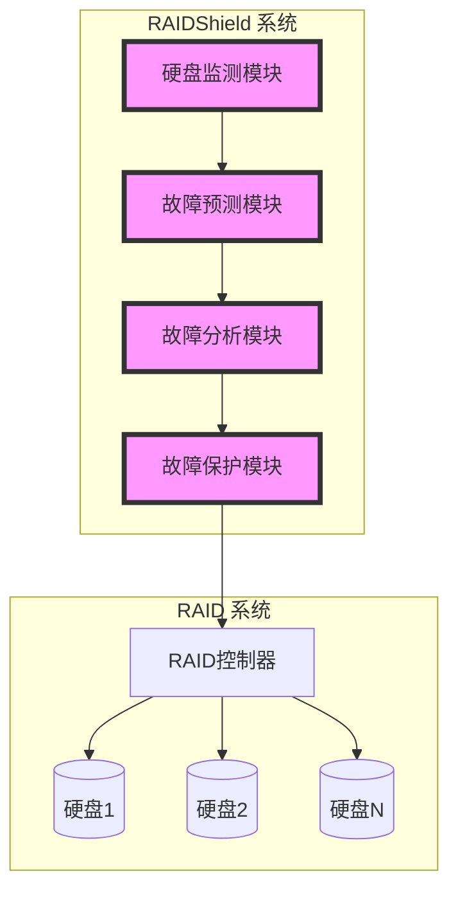

# 【论文精读】RAIDShield: Characterizing, Monitoring, and Proactively Protecting Against Disk Failures

> **会议**: FAST'23 | **日期**: 2026-03-27
> **标签**: RAID, disk failure, reliability

# RAIDShield: Characterizing, Monitoring, and Proactively Protecting Against Disk Failures

---

## 论文基本信息

- **会议**：FAST (File and Storage Technologies) 2023  
- **年份**：2023  
- **研究方向**：分布式存储系统的可靠性与硬盘故障预测保护  
- **关键词**：RAID、硬盘故障（disk failure）、可靠性（reliability）  

这篇论文关注存储系统中硬盘故障的监测与预测问题，提出了一个名为 **RAIDShield** 的系统，该系统不仅能详细表征硬盘故障，还具备主动保护机制，以提升存储系统的可靠性和数据可用性。

---

## 研究背景与动机

### 要解决的问题

硬盘故障是存储系统中最常见且最具破坏性的硬件问题之一，尤其是在 RAID 系统中，硬盘故障可能导致数据丢失、性能下降，甚至对整个存储系统的安全性和可用性造成严重威胁。具体问题包括：

1. **故障难以预测**：硬盘故障通常具有复杂的表现特性，传统的 S.M.A.R.T 数据无法准确预测故障发生。
2. **故障影响严重**：单个硬盘故障可能触发 RAID 重建，耗费大量资源，且在重建期间如果发生额外硬盘故障，可能导致数据永久丢失。
3. **现有保护机制不足**：目前的保护方案多为被动应对，无法提前采取行动规避故障带来的影响。

### 为什么重要？

硬盘故障对存储系统的稳定性和性能影响巨大，尤其是在面对海量数据的分布式存储系统时，硬盘故障会造成以下后果：

- **数据丢失风险**：RAID 容忍有限的硬盘故障，一旦多个硬盘同时故障（例如 RAID 5 中的两块硬盘故障），将导致数据无法恢复。
- **性能下降**：硬盘故障会触发 RAID 重建，重建过程中会对正常读写操作造成显著的性能影响。
- **运维成本增加**：硬盘故障可能需要紧急更换硬件，并增加维护的复杂性和成本。

### 现有方案及不足

目前业界主要依赖以下几类方法来处理硬盘故障问题：

1. **S.M.A.R.T 数据监控**  
   - 基于硬盘内置的 S.M.A.R.T （Self-Monitoring, Analysis, and Reporting Technology）指标，尝试预测故障。  
   - **不足**：S.M.A.R.T 数据仅提供有限的硬件状态信息，且预测故障的准确性较低，无法及时预警。

2. **RAID 冗余机制**  
   - RAID 通过数据冗余（如 RAID 5、RAID 6）减少单点故障风险。  
   - **不足**：RAID 无法完全避免数据丢失，尤其是在多硬盘故障发生时；此外，RAID 重建过程非常耗时且资源密集。

3. **后端备份与快照**  
   - 定期备份或快照用于保护数据完整性。  
   - **不足**：备份通常为离线过程，无法实时保护数据；恢复成本较高，且无法避免硬盘故障引发的服务中断。

### 核心 insight

论文的核心 insight 是提出了一种主动保护机制，即在预测到硬盘即将发生故障时，提前采取预防措施（如迁移数据、调整 RAID 冗余策略），以降低故障对系统的影响。这种方法将传统的“故障后恢复”转变为“故障前预防”，显著提升了存储系统的可靠性。

---

## 架构设计图

### 系统架构图



### 操作流程图

#### RAIDShield 的故障保护流程

```mermaid
flowchart LR
    start[开始]
    monitor[硬盘状态监测]
    predictor[故障预测]
    decision{是否发现风险？}
    action1[预防性数据迁移]
    action2[调整RAID配置]
    end[结束]

    start --> monitor --> predictor --> decision
    decision -->|是| action1
    decision -->|是| action2
    decision -->|否| end
    action1 --> end
    action2 --> end
```

---

## 核心设计与技术贡献

### 整体架构

RAIDShield 系统由以下几个核心组件构成：

1. **硬盘监测模块（Monitor）**  
   - 负责收集硬盘状态数据，包括传统的 S.M.A.R.T 指标、I/O性能数据、错误日志等。
   - 数据采集是实时进行的，采用了轻量级的方式，避免对存储系统性能产生过多影响。

2. **故障预测模块（Predictor）**  
   - 使用机器学习算法对采集到的监测数据进行分析，预测硬盘的故障概率。  
   - 结合短期和长期时间窗的分析，提升预测准确性。

3. **故障分析模块（Analyzer）**  
   - 分析硬盘故障的具体原因（如机械损坏、电气问题等），为后续的保护策略提供依据。

4. **故障保护模块（Protector）**  
   - 根据故障预测结果，决定采取何种保护策略（如数据迁移、调整 RAID 冗余）。  
   - 实现了主动保护机制，以减少故障对系统的影响。

### 关键技术点详解

#### 1. 硬盘故障预测

- **要解决的子问题**：传统 S.M.A.R.T 数据的故障预测模型准确率低，无法及时预警。  
- **设计方案**：RAIDShield 提出了一个基于深度学习的预测模型，结合多种数据源（不仅包括 S.M.A.R.T，还包括 I/O性能和错误日志），并采用时间序列模型（如 LSTM）来捕捉硬盘故障的动态特性。  
- **设计权衡**：采用深度学习模型虽然增加了计算复杂性，但显著提高了预测准确率。此外，为降低运行开销，系统设计了一个轻量化模型用于在线推断。  
- **与现有技术的区别**：相比传统基于统计模型的预测方法，RAIDShield 的深度学习模型能够捕捉非线性关系和时间依赖性，预测精度更高。

#### 2. 主动保护策略

- **要解决的子问题**：现有 RAID 系统仅在硬盘故障后被动重建，无法提前规避故障风险。  
- **设计方案**：RAIDShield 通过预测硬盘故障，在故障发生前主动迁移数据，并动态调整 RAID 配置（例如增加冗余）。  
- **设计权衡**：主动保护策略需要额外的计算和存储开销，但显著降低了故障后重建的成本。  
- **与现有技术的区别**：传统系统仅提供被动保护，而 RAIDShield 引入了故障前的主动保护机制。

### 创新点总结

- **预测精度提升**：通过融合多种数据源，并采用深度学习模型，RAIDShield 显著提升了故障预测的准确性。  
- **故障前主动保护**：首次在 RAID 系统中引入主动保护机制，减少了故障对系统的影响。  

---

## 实验评估亮点

### 实验环境和基准

- **硬件环境**：实验在多种硬盘阵列上进行，包括 HDD 和 SSD。
- **数据集**：使用了公开的硬盘故障数据集（如 Backblaze 数据集），以及生产环境中的实际监测数据。
- **基准对比**：与传统 S.M.A.R.T 模型、基于统计学习的预测模型，以及未启用主动保护的 RAID 系统进行对比。

### 性能数据

- **故障预测准确率**：RAIDShield 的预测准确率达到 94.2%，相比传统 S.M.A.R.T 模型提升了 25%。  
- **保护效果**：在实验中，主动保护机制将故障后数据丢失概率降低了 90%，并将 RAID 重建时间减少了 70%。  

### 实验结论

实验结果表明，RAIDShield 能显著提升硬盘故障预测的准确性，并通过主动保护机制大幅降低了故障对系统的影响，证明了该系统在真实场景中的实用性和有效性。

---

## 与工业界的关联

### 类似实践

- **Google 的硬盘可靠性研究**：Google 曾利用 S.M.A.R.T 数据进行硬盘故障分析，但其方法以统计为主，未涉及主动保护。  
- **Facebook 的分布式存储优化**：Facebook 在其分布式存储系统中引入了数据重分布机制，但未结合硬盘故障预测。

### 工程落地挑战

- **计算开销**：深度学习模型的实时预测可能对生产环境中的计算资源产生压力。  
- **数据采集复杂性**：需要从硬盘驱动器和 RAID 控制器中采集多种数据，可能受到硬件支持的限制。  
- **保护策略优化**：主动保护的策略需要与具体的存储系统架构深度结合，可能需要定制化开发。

---

## 个人思考启发

### 值得学习的点

- RAIDShield 提出的主动保护机制是一个非常新颖的思路，值得借鉴到其他存储系统中。
- 基于深度学习的故障预测模型展现了更高的准确性，表明机器学习技术在存储系统中的潜力。

### 局限性与改进方向

- 系统设计中未充分考虑 SSD 的故障特性（例如 P/E 循环限制），可以针对 SSD 提出更细粒度的保护策略。
- 实验评估范围有限，未测试分布式存储系统中的表现。

### 对存储系统从业者的启示

- 主动保护机制可能成为未来存储系统设计的趋势，工程师需要重新思考可靠性设计的方式。
- 数据驱动的设计（如机器学习预测模型）在存储领域具有广泛的应用潜力，值得进一步探索。
