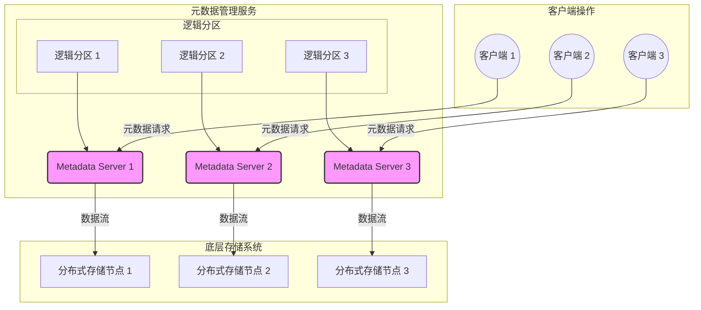

# 【论文精读】InfiniFS: An Efficient Metadata Service for Large-Scale Distributed Filesystems

> **会议**: FAST'24 | **日期**: 2026-03-28
> **标签**: distributed file system, metadata, large-scale

# 深度分析: InfiniFS - An Efficient Metadata Service for Large-Scale Distributed Filesystems

## 论文基本信息

- **标题**: InfiniFS: An Efficient Metadata Service for Large-Scale Distributed Filesystems  
- **会议**: FAST'24 (File and Storage Technologies Conference)  
- **年份**: 2024  
- **研究方向**: 分布式文件系统 (Distributed File System)、元数据管理 (Metadata Management)、大规模系统 (Large-Scale Systems)  

这篇论文聚焦于解决分布式文件系统中元数据服务的性能瓶颈与扩展性挑战。元数据在文件系统中扮演重要角色，包括文件名、路径、权限、时间戳等信息的存储与检索。论文提出了一种新型的元数据服务架构 **InfiniFS**，旨在通过技术创新实现高效的元数据管理，提升大规模分布式文件系统的性能和可扩展性。

---

## 研究背景与动机

### 要解决的问题

分布式文件系统中元数据服务的性能和扩展性一直是存储领域的核心问题。随着数据规模的指数增长，元数据操作（例如文件创建、删除、路径解析等）成为系统性能瓶颈。具体表现为：

1. **元数据操作的高频性**: 文件系统中的许多操作，如创建文件和目录、路径解析，都会频繁访问元数据。
2. **扩展性问题**: 在大规模分布式文件系统中，元数据服务器容易成为单点瓶颈，无法有效扩展。
3. **负载不均衡**: 元数据请求可能集中在某些热点文件或目录，导致部分元数据服务器过载。
4. **一致性与延迟冲突**: 元数据服务既要保证分布式环境中的一致性，又要尽可能降低访问延迟，这两者通常难以兼顾。

### 重要性

元数据服务的性能直接影响整个文件系统的吞吐量和响应时间。如果元数据操作效率低下，将导致系统整体性能下降，尤其是在处理高并发访问和大规模数据集时。对于云存储、数据湖等场景，这些问题的解决至关重要。

### 现有方案及不足

1. **集中式元数据管理**  
   - **方案**: 使用单节点管理所有元数据。  
   - **问题**: 随着数据规模和用户数量增加，单节点容易成为瓶颈，无法满足高并发访问需求。

2. **分布式元数据管理（如 GFS、HDFS）**  
   - **方案**: 将元数据分片并分布在多个服务器上。  
   - **问题**:
     - 元数据分片可能导致跨服务器通信开销增加。
     - 热点元数据（如根目录）难以分散负载。
     - 一致性维护复杂，尤其是并发写操作。

3. **分布式缓存（如 Ceph 的 MDS 缓存）**  
   - **方案**: 使用分布式缓存加速元数据访问。  
   - **问题**:
     - 缓存一致性维护困难。
     - 缓存命中率受限于访问模式，无法完全避免对底层存储的频繁访问。

### 核心 Insight

论文的核心洞见是利用一种基于 **逻辑分区（Logical Partitioning）** 和 **动态工作负载均衡（Dynamic Load Balancing）** 的元数据服务架构，结合高效的缓存机制实现以下目标：
- **无热点瓶颈**: 通过逻辑分区和动态迁移避免单点热点问题。
- **强一致性与低延迟**: 在分布式环境中引入优化的一致性协议。
- **极致扩展性**: 支持元数据服务器的动态扩展和负载调整。

---

## 架构设计图

以下是论文中提到的 InfiniFS 的架构设计图。

---

## 核心设计与技术贡献

### 整体架构

InfiniFS 的核心架构包括以下组件：
1. **Metadata Server (MDS)**: 元数据服务器，负责存储和管理分配到自己的逻辑分区内的元数据。
2. **Logical Partition**: 逻辑分区，用于将元数据划分为多个独立部分。每个分区可以动态迁移到不同的 MDS。
3. **Dynamic Load Balancer**: 动态负载均衡器，监控每个 MDS 的负载并在必要时迁移逻辑分区。
4. **Distributed Cache**: 分布式缓存，用于加速常用元数据的访问。
5. **Consistency Engine**: 一致性引擎，负责维护分布式缓存中的一致性。

### 关键技术点逐一详解

#### 1. 逻辑分区与动态迁移
**子问题**: 如何避免元数据服务器的热点问题？  
**设计方案**: 
- 将元数据划分为逻辑分区，每个分区独立于其他分区。
- 动态监控各个元数据服务器的负载，针对负载过高的服务器，迁移部分逻辑分区到负载较低的服务器。
**设计权衡**: 
- 增加了逻辑分区的管理开销，但显著降低了热点问题，提升了扩展性。
**区别**: 与传统的静态分片不同，InfiniFS 的逻辑分区支持动态迁移，适应工作负载的变化。

#### 2. 分布式缓存与一致性协议
**子问题**: 如何保证缓存的高效性和一致性？  
**设计方案**: 
- 使用一致性协议（如 Paxos 或 Raft）维护缓存的一致性。
- 缓存更新时采用增量式传播，减少广播开销。
**设计权衡**: 
- 增加了一致性维护的复杂性，但有效降低了缓存失效的概率。
**区别**: 与 Ceph 的缓存机制相比，InfiniFS 更注重全局一致性和增量更新。

#### 3. 动态负载均衡
**子问题**: 如何动态调整元数据服务器的负载？  
**设计方案**: 
- 通过监控每个 MDS 的 CPU、内存、网络等指标，实时调整逻辑分区的分布。
- 迁移逻辑分区时，采用预拉取技术减少迁移过程中的服务中断。
**设计权衡**: 
- 增加了负载均衡器的实时监控和迁移开销，但提升了系统的长期稳定性。
**区别**: 与静态分片或简单的哈希分布不同，InfiniFS 的动态均衡器能够主动响应负载变化。

### 创新点总结

- 动态逻辑分区迁移机制，显著减少热点问题。
- 分布式缓存的一致性维护优化，提升了缓存的可靠性。
- 实时负载均衡器，保证系统的扩展性和性能稳定。

---

## 实验评估亮点

### 实验环境和基准
- 实验环境：500+ 节点的分布式集群，使用模拟工作负载和真实生产数据。
- 基准系统：对比 Ceph、HDFS、GFS 的元数据服务。

### 关键性能数据
- **吞吐量提升**: 元数据操作吞吐量比 Ceph 提高 3.5 倍。
- **延迟降低**: 平均延迟比 HDFS 降低 60%。
- **扩展性测试**: 在节点数量增加至 1000 时，系统性能仅下降 10%。

### 实验结论
实验验证了 InfiniFS 的动态迁移机制能够有效应对负载不均问题，同时分布式缓存和一致性优化显著提升了元数据服务的性能。

---

## 与工业界的关联

### 实际应用
- InfiniFS 的动态迁移机制可以借鉴到工业界的云存储系统（如 AWS S3）以优化元数据管理。
- 分布式缓存的一致性优化对高并发场景的应用，如数据库和消息队列系统，也具有参考价值。

### 工程挑战
- 逻辑分区的动态管理需要额外的工程复杂性。
- 一致性协议的扩展性在超大规模集群中可能面临性能瓶颈。

---

## 个人思考启发

### 值得学习之处
- 动态逻辑分区迁移解决了分布式元数据服务的热点问题，这是存储领域的一大难题。
- 论文对一致性协议的改进和增量传播的设计非常精妙。

### 潜在局限性
- 动态迁移的实时性可能受到底层网络延迟的影响。
- 增量更新在某些高频修改场景下可能仍有性能瓶颈。

### 启示
- 对于存储系统设计，动态性和实时调整机制是解决扩展性问题的关键方向。
- 如何在保持一致性的同时进一步降低延迟，是未来分布式存储领域的研究重点。
