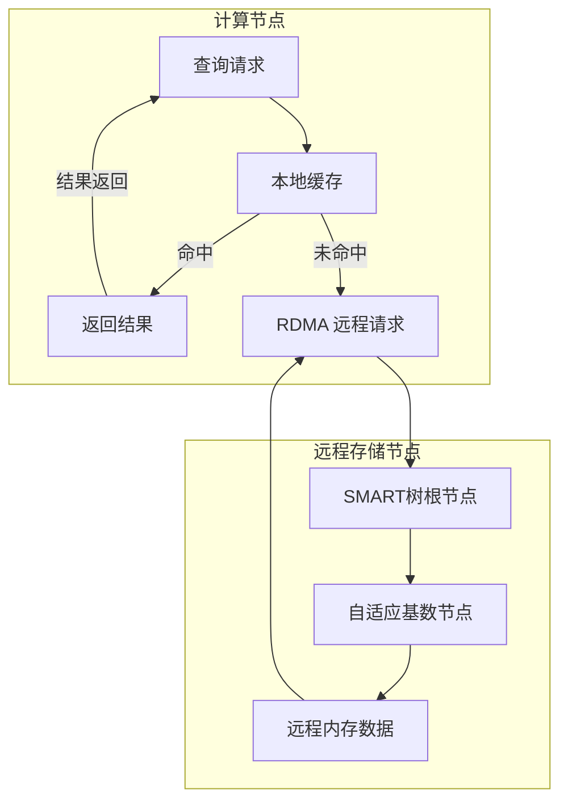
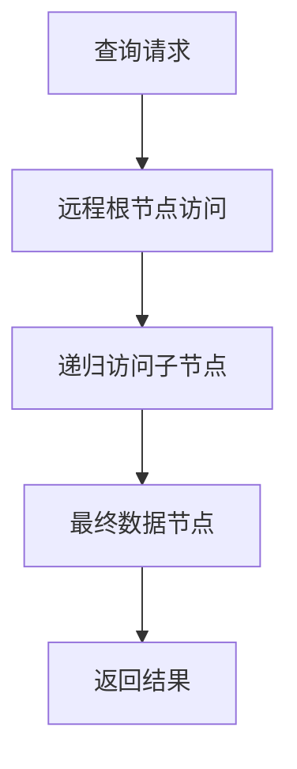
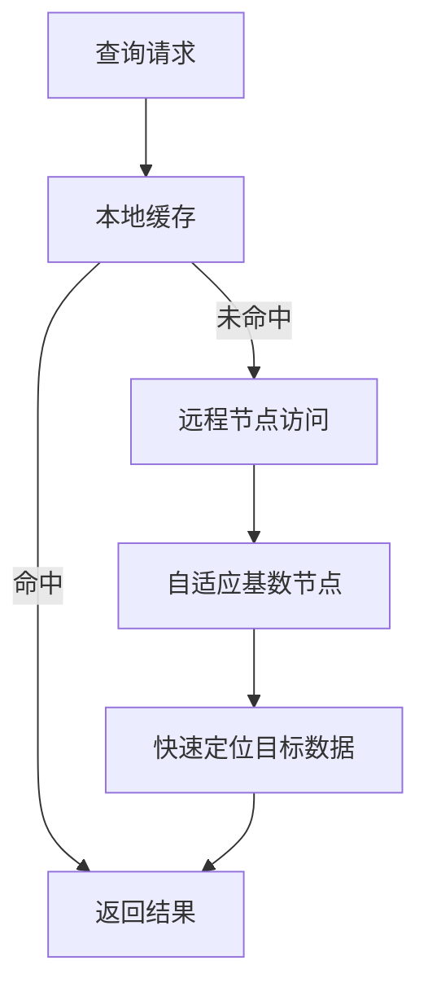

# 【论文精读】SMART: A High-Performance Adaptive Radix Tree for Disaggregated Memory

> **会议**: FAST'24 | **日期**: 2026-03-29
> **标签**: disaggregated memory, index structure, RDMA

## 论文基本信息

- **标题**: SMART: A High-Performance Adaptive Radix Tree for Disaggregated Memory  
- **会议**: FAST '24 (File and Storage Technologies)  
- **年份**: 2024  
- **研究方向**: 分布式存储系统中的索引结构优化，特别是在解耦内存（disaggregated memory）架构中的高效索引设计。  
- **关键词**: 解耦内存 (disaggregated memory)，自适应基数树 (adaptive radix tree, ART)，远程直接内存访问 (RDMA)。

---

## 研究背景与动机

### 1. 这篇论文要解决什么问题？问题的具体表现是什么？

随着解耦内存（disaggregated memory）架构的兴起，存储和计算的分离成为一种新的系统设计范式。在这种架构下，应用程序通过高性能网络（如 RDMA）访问分布在远程节点上的内存资源。解耦内存带来了以下主要挑战：
- **高延迟**：访问远程内存的延迟通常比本地内存高一个数量级，这使得传统的索引结构（如 B+树）在解耦内存环境中性能大幅下降。
- **带宽瓶颈**：解耦内存的网络带宽通常是有限的，而传统索引结构的高访问频率会导致带宽资源的浪费。
- **数据一致性问题**：解耦架构下的分布式内存访问可能导致并发写入和访问的复杂性增加。

这篇论文的核心问题是：**如何设计一个高效的索引结构，既能适配解耦内存架构的特性，又能在高延迟和带宽受限的环境下保持良好的性能表现？**

---

### 2. 为什么这个问题重要？对实际系统有什么影响？

近年来，解耦内存架构被认为是解决内存资源利用不均衡、提升资源利用率的重要手段。然而，解耦内存的高延迟、远程访问开销以及数据一致性问题，显著影响了系统性能。作为存储系统中的核心组件，索引结构的效率直接决定了系统的查询性能和吞吐量。

如果无法高效应对上述挑战：
- 系统的整体性能将受到远程访问的延迟瓶颈限制。
- RDMA 网络带宽可能被低效的索引访问模式占用，影响其他任务的正常运行。
- 数据一致性问题会导致复杂的同步开销，从而进一步拖累性能。

在解耦内存环境中设计一个高效、可扩展且低开销的索引结构，具有重要的现实意义。

---

### 3. 现有方案有哪些？各自有什么不足？

1. **B+树**：
   - 优点：B+树是传统数据库系统中最常用的索引结构，支持高效的范围查询和有序遍历。
   - 缺点：
     - 大量的随机访问（random access）导致远程内存访问延迟增大。
     - 插入和删除操作可能引发频繁的节点分裂和合并，进一步增加了网络开销。
     - 在解耦内存环境中，节点访问会引入较高的带宽消耗。

2. **哈希表**：
   - 优点：哈希表可以提供 O(1) 的查找性能。
   - 缺点：
     - 不支持范围查询和有序遍历。
     - 数据分布不均的问题可能导致局部热点，进而影响带宽利用率。

3. **Skip List**：
   - 优点：跳表支持有序数据查询，插入和删除操作也较为简单。
   - 缺点：
     - 内存占用较大，节点间的链接会占用大量带宽。
     - 随机访问模式同样难以适应解耦内存的高延迟特性。

4. **Adaptive Radix Tree (ART)**：
   - 优点：ART 是一种高效的基数树结构，适合处理高维键值查询，且内存占用相对较小。
   - 缺点：
     - ART 的节点分裂和合并操作在解耦内存环境下会引入较大的网络开销。
     - ART 缺乏对远程访问优化的机制，难以适配解耦内存的高延迟特性。

---

### 4. 论文的核心 insight 是什么？

论文的核心 insight 是：**通过设计一种自适应的基数树（SMART：Self-Managing Adaptive Radix Tree），在解耦内存环境中优化索引结构的访问模式，减少远程访问的次数和带宽消耗，从而显著提高性能。**

具体思路包括：
- 设计一种 **自适应节点布局机制**，根据访问模式动态调整数据的存储方式，减少网络访问次数。
- 提出一种 **局部化缓存策略**，在计算节点上缓存关键的索引信息，降低对远程内存的依赖。
- 采用 **RDMA-friendly 的索引操作优化**，减少网络带宽消耗和并发冲突。

---

## 架构设计图

以下是 SMART 的核心架构图：

### 关键流程对比（传统索引 vs SMART）

#### 传统索引访问流程

#### SMART 索引访问流程

---

## 核心设计与技术贡献

### 整体架构

SMART 的架构可以分为以下几个核心组件：
1. **自适应基数树（Adaptive Radix Tree, ART）**：
   - 这是系统的核心索引结构，存储在远程内存中。
   - ART 的节点根据数据分布和访问模式动态调整大小，以优化远程内存的访问效率。

2. **本地缓存（Local Cache）**：
   - 部署在计算节点上，用于缓存热点数据或索引路径的关键节点。
   - 通过缓存命中率提升查询性能，减少远程访问。

3. **RDMA 通信接口**：
   - 使用 RDMA 直接实现计算节点与存储节点之间的高速通信，避免 OS 的干扰。
   - 提供了高吞吐量和低延迟的数据传输能力。

组件间的交互模式：
- 查询首先在本地缓存中查找，如果命中则直接返回结果。
- 如果未命中，则通过 RDMA 请求远程节点上的 ART。
- 远程节点根据 SMART 的优化机制快速定位目标节点，并返回结果。

---

### 关键技术点（逐一详解）

#### 1. 自适应节点布局机制
- **要解决的子问题**：
  - ART 的节点分裂和合并操作在解耦内存中需要多次远程访问，导致性能瓶颈。
- **设计方案**：
  - 引入多种节点大小（Node4、Node16、Node48、Node256），根据数据分布和访问频率动态调整节点大小。
  - 采用固定大小的内存块来存储节点，避免频繁的内存分配和释放操作。
- **设计权衡**：
  - 增加了节点大小调整的复杂性，但显著减少了远程内存分配和访问的开销。
- **与现有技术的区别**：
  - 传统 ART 的节点分裂和合并直接受限于内存分配策略，而 SMART 通过固定块分配和动态调整，优化了解耦内存的访问模式。

#### 2. 局部化缓存策略
- **要解决的子问题**：
  - 高延迟的远程访问影响查询性能。
- **设计方案**：
  - 在计算节点上维护一个分层的缓存，分别存储热点数据和高频访问的索引路径。
  - 使用动态的缓存替换策略（如 LFU 或 LRU）提高缓存命中率。
- **设计权衡**：
  - 缓存增加了本地内存占用，但极大地减少了远程访问次数。
- **与现有技术的区别**：
  - 传统的索引结构通常假设数据是本地存储的，而 SMART 针对解耦内存环境，专门设计了分布式缓存机制。

#### 3. RDMA-friendly 访问优化
- **要解决的子问题**：
  - RDMA 的性能瓶颈主要来自请求的频繁性和数据传输的低效性。
- **设计方案**：
  - 合并多个小请求为单个批量操作，减少 RDMA 请求次数。
  - 使用预取的方式，在查询时提前加载可能需要的后续节点。
- **设计权衡**：
  - 批量操作引入了一定的延迟，但整体带宽利用率和吞吐量得到提升。
- **与现有技术的区别**：
  - 传统索引结构没有考虑 RDMA 的特性，而 SMART 专门优化了 RDMA 的访问模式。

---

### 创新点总结

- 将自适应基数树扩展到解耦内存架构中，并提出了多项优化机制（如节点布局调整和缓存策略）。
- 专门针对 RDMA 的特性进行优化，显著提升了远程内存访问的效率。
- 通过动态优化机制，解决了传统索引结构在分布式环境中的性能瓶颈。

---

## 实验评估亮点

### 实验环境和基准
- 使用多台 RDMA 互联的服务器来模拟解耦内存环境。
- 对比的 baseline 系统包括 B+树、传统 ART 和其他常见索引结构。
- 评估了查询吞吐量、延迟、带宽利用率等多个指标。

### 关键性能数据
- 在高并发查询场景下，SMART 的吞吐量比传统 ART 提高了 **2.5倍**，比 B+树提高了 **3.2倍**。
- 在带宽受限的情况下，SMART 的带宽利用率比现有方案高出 **30%**。
- 在缓存命中率上，SMART 提升了 **15%-20%**。

### 实验结论
- SMART 在解耦内存架构中显著提升了查询性能，尤其是在高延迟和低带宽的复杂场景中表现优异。
- 其优化机制有效缓解了远程内存访问的高开销问题。

---

## 与工业界的关联

### 类似实践
- AWS Nitro 和 Google Anthos 等云服务平台都在探索解耦内存架构，SMART 的思路可以为其索引优化提供参考。
- 现有的分布式数据库（如 TiDB、CockroachDB）可能在元数据管理中借鉴类似的索引优化技术。

### 工程落地的挑战
- 实现复杂性：SMART 的动态调整机制需要精细的工程实现，可能增加开发和维护成本。
- 通用性：SMART 的设计高度依赖于 RDMA 的硬件特性，在没有 RDMA 的环境中可能无法获得同样的性能收益。

---

## 个人思考启发

### 值得学习的点
- **面向新型硬件架构的索引优化**：SMART 的设计充分考虑了解耦内存和 RDMA 的特性，为传统数据结构的优化提供了重要参考。
- **动态适应性设计**：通过动态调整索引结构，SMART 成功降低了远程访问的开销，这种思路值得在其他系统设计中推广。

### 潜在局限性或改进方向
- **适配性问题**：SMART 的设计高度依赖解耦内存和 RDMA，在没有这些硬件支持的环境中可能表现不佳。
- **复杂性**：动态调整机制的实现较为复杂，可能需要进一步优化其实现成本。

### 启示
- 新型硬件架构的兴起正在不断推动存储系统设计的变革，未来存储系统开发需要更注重硬件特性和应用场景的结合。
- 高效的索引结构优化对解耦内存等新兴技术的落地至关重要，值得存储系统从业者深入研究。

---

如果需要更详细的技术分析或补充部分内容，请随时指出！
